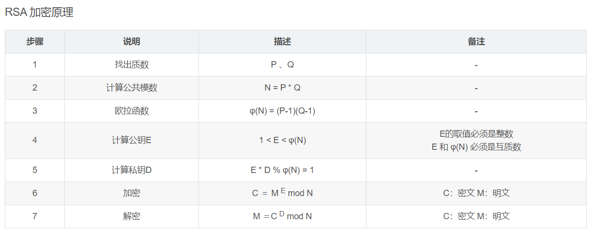

# Crypto：密码学

### 数学、密码学，以及脑洞

---
# Crypto

**Encrypt（加密） & Decrypt（解密）**

- 古典密码

- 对称加密（流密码/块加密）

- 非对称加密

- 其它
  
---

# 古典密码

- 前置知识：

  - 几大类[古典密码](https://zhuanlan.zhihu.com/p/59640066)：

    - 单表代换密码：每个明文字母都有一个密文字母进行对应，攻击者可能通过观察某些密文字母出现的频率来猜测其对应的明文。

    - [栅栏密码](https://baike.baidu.com/item/%E6%A0%85%E6%A0%8F%E5%AF%86%E7%A0%81/228209?fr=aladdin)：利用明文字母的排列组合进行加密。

    - [维吉尼亚密码](https://baike.baidu.com/item/%E7%BB%B4%E5%90%89%E5%B0%BC%E4%BA%9A%E5%AF%86%E7%A0%81/4905472?fr=aladdin)：用字符串作为密钥，按照字符串中每个字符在字母表中的次序对明文进行循环加密。

    - ......

---

- 入门级：凯撒密码(cyberpeace)

    - [通过单纯的移位](https://www.qqxiuzi.cn/bianma/kaisamima.php)来完成加解密:

      `oknqdbqmoq{kag_tmhq_xqmdzqp_omqemd_qzodkbfuaz}`

- 入门级：栅栏密码(cyberpeace)

    - [通过特殊规则](http://www.atoolbox.net/Tool.php?Id=777.com)来完成加解密：

      `ccehgyaefnpeoobe{lcirg}epriec_ora_g`

    - 注意，这个谜面的栅栏加密方式加了点小佐料~

---

# 对称加密：加解密同密钥

## 流加密

- 明文流与密钥流长度相等

## 块密钥

- 一个分组密钥可以加密多块数据

---

- 成长级：阅读[伪代码](Easy_Crypto/Easy_Crypto/enc/附件.txt)，判断它是[什么加/解密方式](https://baike.baidu.com/item/RC4/3454548?fr=aladdin)，并编程实现它的功能：

---

  - 

---

# 非对称加密：加解密不同密钥

  - 前置知识一：

    - 非对称加密相对于对称加密的一个最大的不同在于：它的加密和解密所使用的密钥是不同的，用来加密的密钥不能用来解密，用来解密的密钥也无法用来加密。

    - 当前比较常见的两种非对称加密：

      - RSA（基于两个大素数积的分解困难性）

      - ECC（基于椭圆曲线上的有理点构成Abel加法群上椭圆离散对数的计算困难性）

---

  - 前置知识二：

  

---

- 入门级：RSA 求乘法逆元

  - 住你上铺的兄弟突然声称他掌握了某项黑科技，并向你发送了一个压缩包，这看起来十分可疑！

    - [此事平平无奇]()（-5 来自同学的好感）

    - [调查](RSA256/)（+10 来自同学的好感，+10 科技点数）

---

  - 首先，打开这个压缩包；

  - 解压出来一个无后缀文件名，是不是还要再解压一次？；

  - 查看内部文件，发现除了加密文本之外，还有个 `gy.key` ，这时候就需要用到 `OpenSSL` 工具来读取其中的公钥信息；

  - 通过解码获得了 n 和 e ，先试试[ N 能不能分解成 p 和 q ](http://factordb.com/)？

  - 居然可以！现在我们有了 p q n e ，还能从它们解出 φ(n)，回忆一下前置知识2-7，这时候就可以尝试解 e 的乘法逆元 d 了。

  ---

  - 入门级：RSA 求最大公约数

    - 上铺的兄弟对你的配合很感激，于是向你发送了并夕夕零食链接，并表示你可以任意选购其中任意一种，但你发现他发送的链接好像有点不对劲————他居然同时发了两个文件！

      - 算了算了，还是零食重要，调查[文件](RSA_gcd/attachment/attach1.txt)

      - 放马过来，看我再破一题！调查[文件](RSA_gcd/attachment/attach2.txt)

---

  - 题目开门见山，明明白白告诉我们，要求 `最大公约数` ，看来这是核心，打开文件，果然有两个 n 等着我们；
  
  - python为我们提供了相当便捷的工具库（当然如果你想自己实现一遍算法也是完全ok的），我们可以通过工具来算出它们的 `最大公约数` ，由于 `p` 和 `q` 都是大素数，则这个公约数必定就是 `p*q` 中的一个；
  
  - 有了这个 `p` ，我们就可以通过这个 `p` 推出每个 `n` 对应的另一个乘数 `q` ，现在我们又再次拿到了 `n p q e` ，对 `d` 求解就顺理成章了。

  - 拿到私钥，由前置知识2-7，我们就可以解出对应的明文了。

  ---

  # 其它类型

  ## 推理类型

  - 成长级：上铺兄弟最近又新学了Java Script，他写了一个[网页](Flag_In_Your_Hand/index.html) 和 [对应的源代码](Flag_In_Your_Hand/script-min.js)，并声称你前两次的实力得到了他的认可，是时候决出寝室 `Crypto King` 的归属权了。

    - 让我们结束这场哑谜吧！

---

  ## 编解码类型

  - 与上节课中 `MISC` 分类有部分重合，本质上都是考验我们 `对编码类型的敏感程度` ：

    - [老套娃了](混合编码/mixed_coding.txt)

---

  - 看到结尾有 `=` ，第一反应：Base64！

  - [Base64 解码](http://tool.chinaz.com/Tools/Base64.aspx)之后，看到这串字符串，怎么看都感觉还是 Base64，再解一遍！

  - 解完发现是一串 数字 + 斜线 ，数字还都是 ASCII 码表上 `字母区间` 里的，直接对照 ASCII 码表破译即可。

---

## 隐写类型

  - 与上节课中 `MISC` 分类有部分重合，内容基本一致，此处不再展开讲解。

---

## 参考链接

- https://adworld.xctf.org.cn/task?now_checked_num=5&name=crypto

- http://tool.chinaz.com/Tools/Base64.aspx

- https://zhuanlan.zhihu.com/p/59640066

- https://littleround.cn/2019/03/18/%E5%8F%A4%E5%85%B8%E5%8A%A0%E5%AF%86%E7%AE%97%E6%B3%95%E4%BB%8B%E7%BB%8D-%E4%BA%8C/

---

## 本期作业

平台：[xctf](https://adworld.xctf.org.cn/) 

writeups： [writeup](https://blog.csdn.net/Ryannn_/article/details/102708011#0x02%20Morse)、[ 攻防世界  简单题 ](https://adworld.xctf.org.cn/task/task_list?type=crypto&number=5&grade=0&page=1)

---

1. MD5 【易】

   本题非常简单，题目大意为给定一个 md5 值，然后找出明文， md5 爆破即可。

2. easy_RSA【易】

3. Normal_RSA【易】

---

4. 幂数加密【易】

5. fanfie【难】

   混合加密+仿射密码

6. easy_ECC【难】

   需要编码，考察对椭圆加密公钥算法的理解，需要对 ECC算法具有一定的了解，然后编程实现。