# CTF入门之misc方向初探

## 压缩包及图片隐写

---

> misc是什么呢？
> 
> Misc 是英文 Miscellaneous 的前四个字母，杂项、混合体、大杂烩的意思。[CTF-wiki | misc介绍](https://ctf-wiki.org/misc/introduction/)
> - Recon（信息搜集）
>   - 主要介绍一些获取信息的渠道和一些利用百度、谷歌等搜索引擎的技巧
> - Encode（编码转换）
>   - 主要介绍在 CTF 比赛中一些常见的编码形式以及转换的技巧和常见方式
> - Forensic && Stego（数字取证 && 隐写分析）
>   - 隐写取证是 Misc 中最为重要的一块，包括文件分析、隐写、内存镜像分析和流量抓包分析等等，涉及巧妙的编码、隐藏数据、层层嵌套的文件中的文件，灵活利用搜索引擎获取所需要的信息等等。

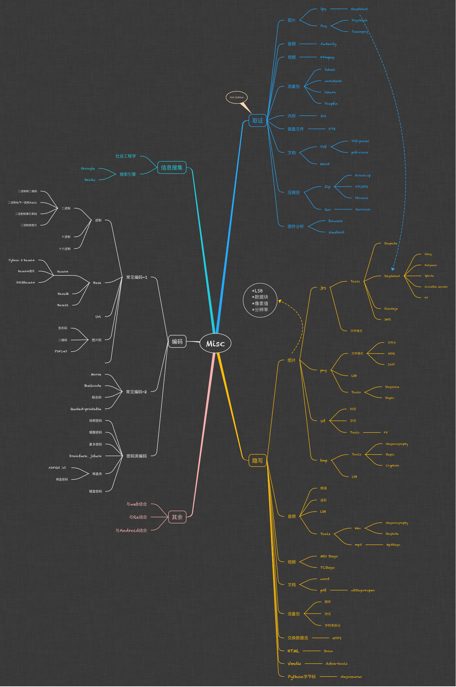

---

## 后缀名和魔数的区别

| 特征 | 文件后缀名 (File Suffix) | 魔数 (Magic Number) |
| :--- | :--- | :--- |
| **本质** | 外在的命名约定，给人看的标签 | 内在的数据标记，给程序看的标识 |
| **位置** | 文件名的末尾 | 文件二进制数据的开头 |
| **作用** | 方便用户和操作系统关联程序 | 程序用来准确识别文件真实类型 |
| **可靠性** | **低**，可以随意修改和伪造 | **高**，是文件内容的一部分，修改即损坏 |
| **修改影响** | 只影响文件的图标和默认打开方式 | 会导致文件损坏，无法被正常程序识别 |

---

## 查看文件的十六进制内容

在一些 CTF 的 Misc 题目中，我们需要查看文件的十六进制内容来查看文件结构和判断文件类型，用什么工具呢？

可借助十六进制编辑器，如[`010 Editor`](https://www.sweetscape.com/010editor/)、[`WinHex`](https://x-ways.net/winhex/)、[`ImHex`](https://github.com/WerWolv/ImHex)等，直接查看与分析二进制。

---

## 尝试使用010editor打开几个文件（图片）

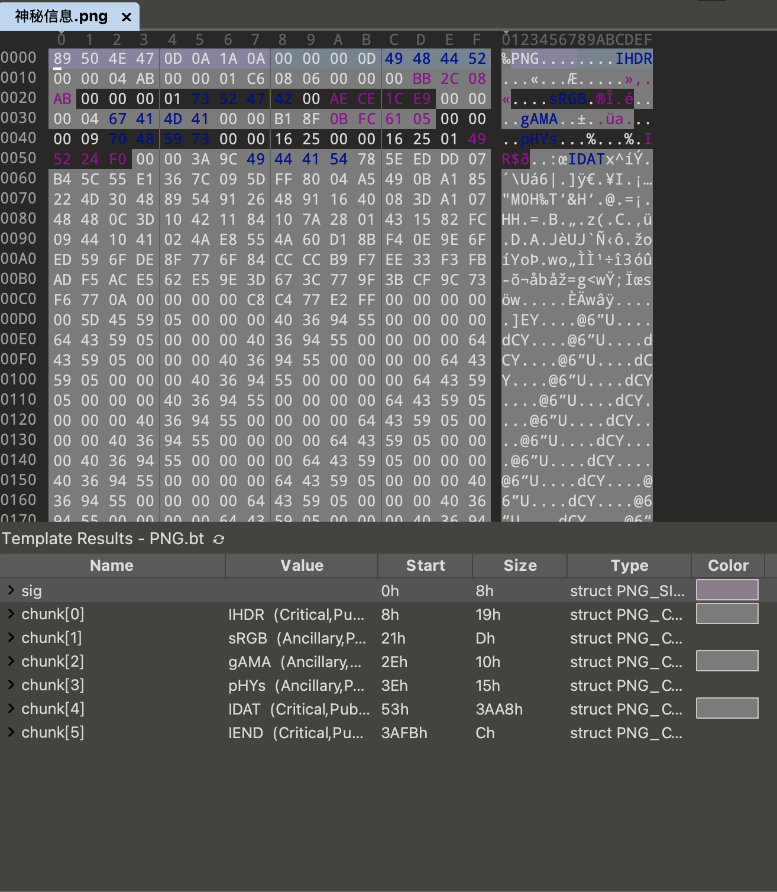
使用010打开`png`展示

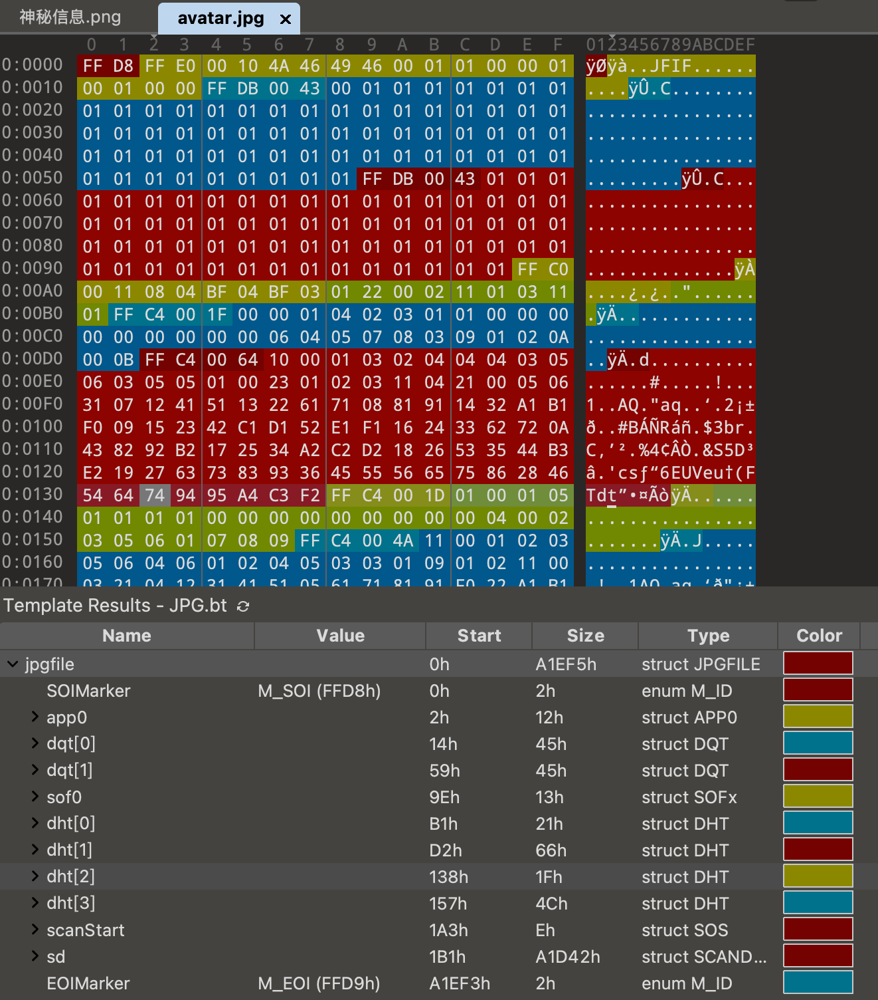
使用010打开`jpg`展示

使用010打开`gif`展示

---

## 尝试使用010editor打开几个文件（常见文件类型）

使用010打开`zip`展示

使用010打开`pdf`展示

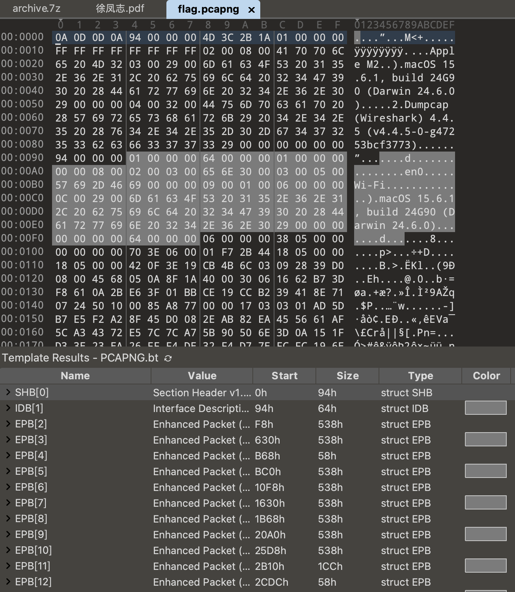
使用010打开`pcapng`展示

---

## 尝试使用010editor打开几个文件

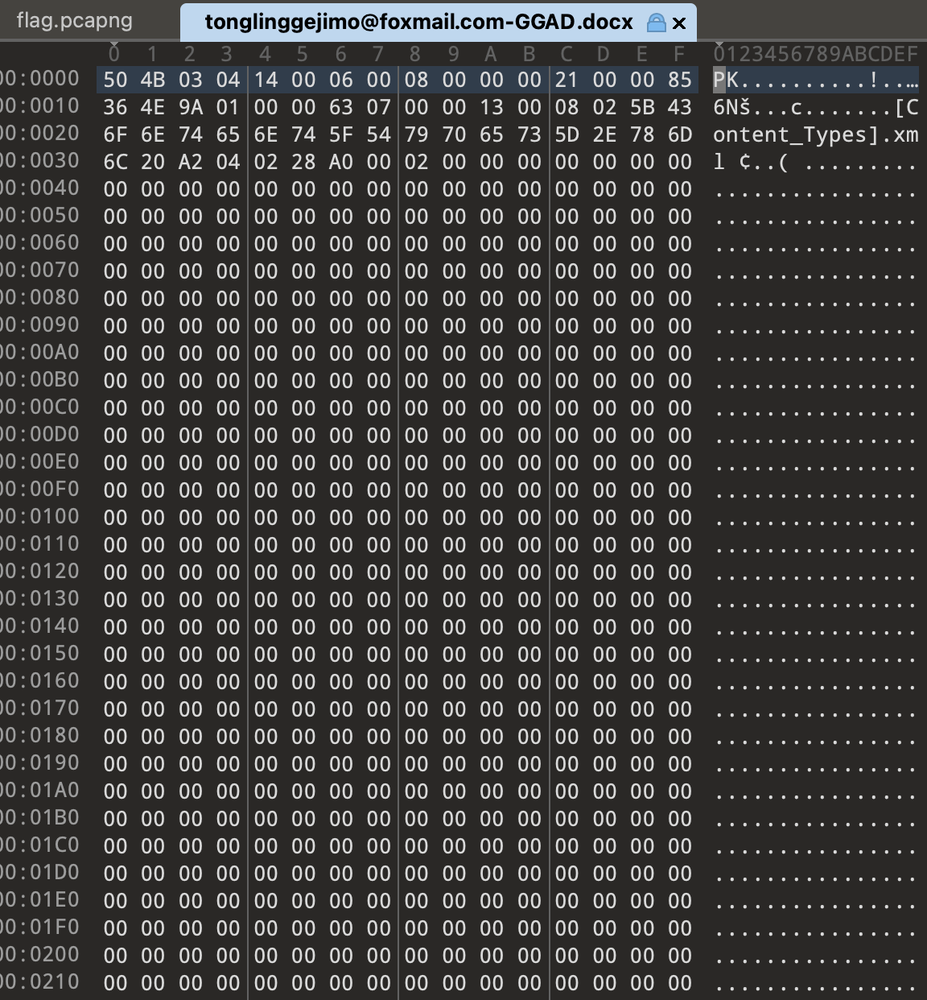
使用010打开`docx`展示

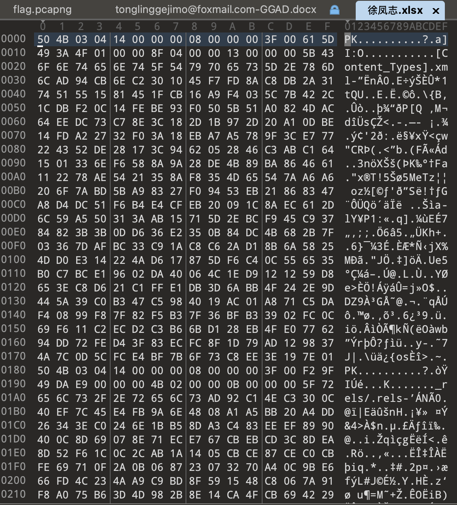
使用010打开`xlsx`展示

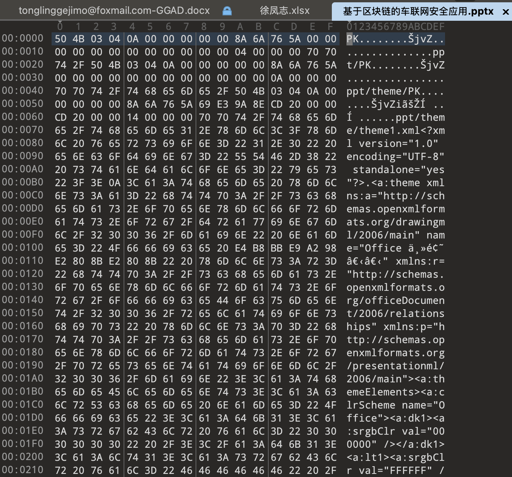
使用010打开`pptx`展示

---

其他文件我就不再展示了，大家有兴趣可以自行去探索，以及熟悉熟悉`010editor`编辑器的使用

`Tips`：如果题目提供附件，建议在 `010 Editor` 中仔细查看，或许会有意外收获。😏

---

## 文件结构隐写

很多文件可能会包含一些冗余数据，而这些冗余数据在正常打开的时候可能是感觉不到的，但是我们可以通过之前提到的十六进制编辑器来查看文件的结构，从而发现这些冗余数据，解出隐写的信息。

题目链接：
- [文件结构隐写](https://www.nssctf.cn/problem/3375)

---

## 1. 压缩包介绍

---
 
> 什么是压缩包？
>
>压缩包是一种文件格式，用于将多个文件打包成一个文件，极大的进行压缩，用来减小文件存储和提高传输效率，通常用于传输和存储。

压缩算法的核心思想是**寻找并消除冗余**。计算机文件中的数据其实存在很多重复的模式。

举一个简单的例子，假设一个文本文件里有这样一句话：`AAAAABBBBBCCCCCC`

这句话有16个字符。压缩算法可能会这样记录它：`A(5)B(5)C(6)`

这样只需要6个字符的记录空间，就存下了同样的信息。解压缩时，程序会根据这个记录把原始内容“还原”出来。实际的压缩算法比这个复杂得多，但基本原理是相通的。

---

## 有哪些常见的压缩包格式？(此处列举了部分压缩包格式以及对应的文件头、特点)

| 格式名称 | 文件头 (Hex) | 文件头 (ASCII) | 特点 |
| :--- | :--- | :--- | :--- |
| **ZIP** | `50 4B 03 04` | `PK..` | 最通用的格式，兼容性极佳，几乎所有操作系统都原生支持。|
| **JAR** | `50 4B 03 04` | `PK..` | Java Archive，本质上是 ZIP 格式。|
| **PHAR** | 不固定 | `...__HALT_COMPILER();?>` | PHP Archive，用于打包和分发 PHP 应用程序。|
| **RAR** | `52 61 72 21 1A 07 00` (RAR 4.x) `52 61 72 21 1A 07 01 00` (RAR 5.0) | `Rar!...` | 压缩率通常高于 ZIP。支持错误恢复记录（Recovery Record），可以修复轻微损坏的压缩包。格式相对封闭，解压免费但压缩算法是专有的。 |
| **7z** | `37 7A BC AF 27 1C` | `7z¼¯'` | 开源格式，拥有非常高的压缩率（LZMA/LZMA2 算法）。支持强大的 AES-256 加密。(会有针对该算法的专门考题)需要 7-Zip 或兼容的软件来处理。 |
| **Gzip** | `1F 8B 08` | `...` | 只压缩单个文件，不进行打包。在 Linux/Unix 世界中极为常用，通常与 `tar` 结合使用（`.tar.gz`）。`gzip` 的 `gz` 代表 GNU Zip。 |
| **bzip2** | `42 5A 68` | `BZh` | 另一种单文件压缩工具，通常比 Gzip 压缩率更高，但速度更慢。也常与 `tar` 结合使用（`.tar.bz2`）。 |
| **xz** | `FD 37 7A 58 5A 00` | `ý7zXZ.` | 使用 LZMA/LZMA2 算法的现代单文件压缩工具。压缩率非常高，常作为新一代 Linux 软件包的压缩标准，与 `tar` 结合为 `.tar.xz`。 |
| **TAR** | 无固定魔数 (在偏移量 257 处有 `75 73 74 61 72`) | `ustar` (在偏移量 257 处) | Tape Archive，只负责将文件和目录结构“打包”成一个文件，本身不压缩。完美保留 Unix/Linux 的文件权限和元数据。必须与其他压缩工具（如 `gzip`, `bzip2`, `xz`）结合才能减小体积。 |
| **ISO** | 无固定魔数 (在偏移量 0x8001 处有 `43 44 30 30 31`) | `CD001` (在偏移量 0x8001 处) |

---

## ZIP格式讲解

ZIP 文件主要由三部分构成，分别为压缩源文件数据区（local file header + file data）、核心目录（central directory）、目录结束（end of central directory record）

详情可看:
[Hello-ctf | misc | 压缩包 ｜ ZIP](https://hello-ctf.com/hc-misc/Archivefile/#zip)
[CTF-Wiki | misc | 压缩包 ｜ ZIP](https://ctf-wiki.org/misc/archive/zip/)

---

源文件区域区
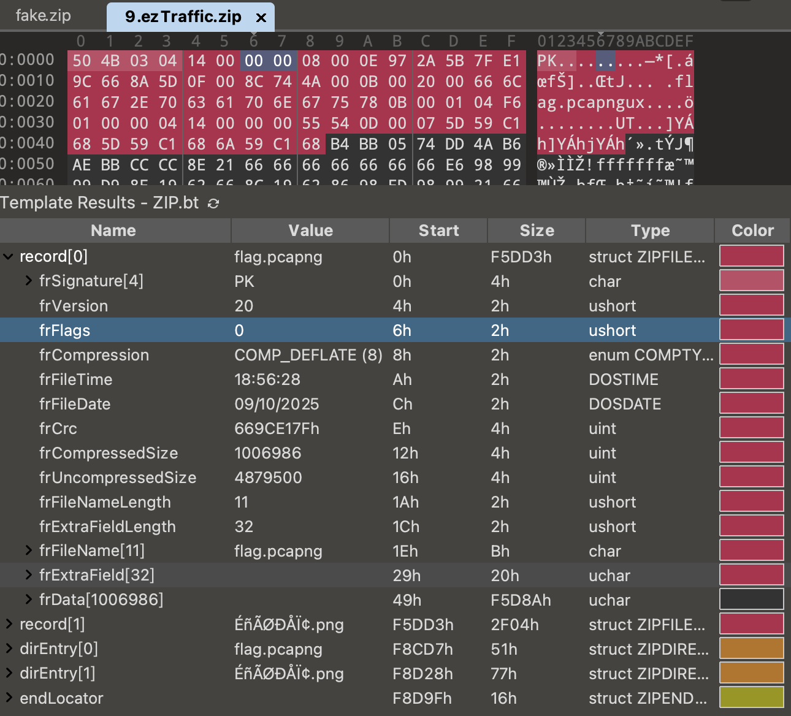

- ZIPFILERECORD record # 压缩源文件数据区
    - char frSignature[4] # 压缩源文件标志
    - ushort frVersion # 压缩源文件版本
    - ushort frFlags # 压缩源文件标志 （有无加密）
    - enum COMPTYPE frCompression
    - DOSTIME frFileTime # 压缩源文件时间
    - DOSDATE frFileDate # 压缩源文件日期
    - uint frCrc # 源文件CRC32校验值
    - uint frCompressedSize # 源文件压缩后大小
    - uint frUncompressedSize # 源文件压缩前大小
    - ushort frFileNameLength # 源文件名长度
    - ushort frExtraFieldLength # 源文件扩展域长度
    - char frFileName[frFileNameLength] # 压缩源文件名
    - uchar frData[frCompressedSize] # 压缩源文件数据

---

- ZIPDIRENTRY dirEntry # 压缩源文件目录区
    - char deSignature[4] # 目录标志
    - ushort deVersionMadeBy # 创建该条目的版本
    - ushort deVersionNeeded # 解压该条目所需的版本
    - ushort deFlags # 标志位(`存在加密的标志位`)
    - enum COMPTYPE deCompression # 压缩方法
    - DOSTIME deFileTime # 最后修改时间
    - DOSDATE deFileDate # 最后修改日期
    - uint deCrc # CRC32校验值
    - uint deCompressedSize # 压缩后的大小
    - uint deUncompressedSize # 压缩前的大小
    - ushort deFileNameLength # 文件名长度
    - ushort deExtraFieldLength # 扩展域长度
    - ushort deFileCommentLength # 文件评论长度
    - ushort deDiskNumberStart # 起始磁盘编号
    - ushort deInternalAttributes # 内部属性
    - uint deExternalAttributes # 外部属性
    - uint deRelativeOffset # 该条目在 ZIP 文件中的偏移位置
    - char deFileName[deFileNameLength] # 文件名
    - char deExtraField[deExtraFieldLength] # 扩展域
    - char deFileComment[deFileCommentLength] # 文件评论

核心目录区
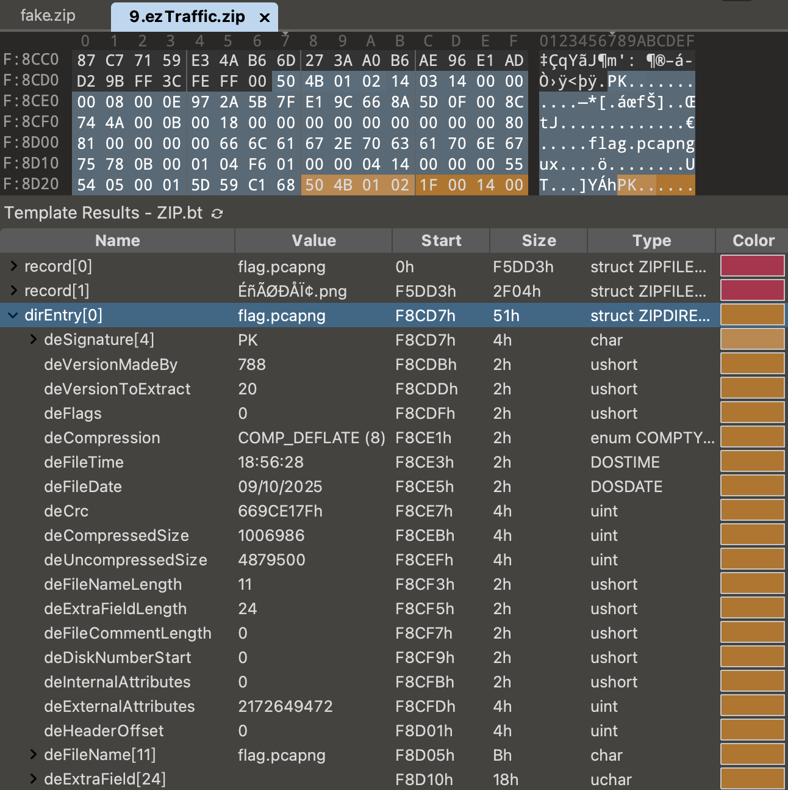
    

---

- ZIPENDLOCATOR endLocator # 压缩源文件目录结束标志
    - char elSignature[4] # 结束标志
    - ushort elDiskNumber # 当前磁盘编号
    - ushort elStartDiskNumber # 目录开始的磁盘编号
    - ushort elEntriesOnDisk # 当前磁盘上的条目数量
    - ushort elEntriesTotal # 总条目数量
    - uint elSizeOfDirectory # 目录的总大小
    - uint elOffsetOfDirectory # 目录开始的偏移位置
    - ushort elCommentLength # 注释长度
    - char elComment[elCommentLength] # 注释

目录结束区
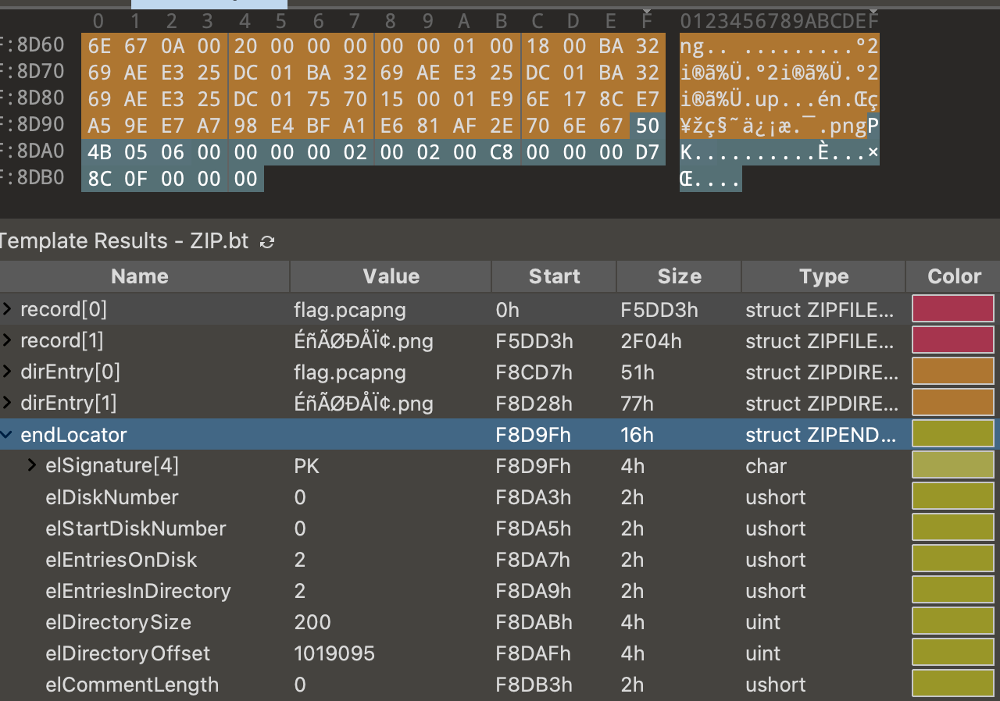

---

## 压缩包解题常用工具：

压缩/解压工具：[7-Zip](https://www.7-zip.org/)、[Bandizip](https://www.bandisoft.com/bandizip/)
解题工具：ARCHPR、[Ziperello](https://ziperello.apponic.com/)、[bkcrack](https://github.com/kimci86/bkcrack)
一些大佬写的好用的解题脚本
[ZipCracker](https://github.com/asaotomo/ZipCracker)、[CRC32-Tools](https://github.com/AabyssZG/CRC32-Tools)、[7z-tools](https://github.com/yo-wotop/7z-tools)
ARCHPR的分享链接在这里。
分享名称：misc相关工具  链接：`https://kod.cuc.edu.cn/#s/_x2yQqRQ`  提取码：`e9fNO`

>`注：`不要过分依赖工具！！！——Hello-ctf
>
> MISC 是一个对编程能力要求比较高的方向，不过大多数考点的固定衍生出比较多的 " 轮子"，当然轮子减少手动操作，确实是好东西，但是容易产生一些弊端，因为跳过了手动操作所以不懂原理也能梭题目，可能会导致选手略过本来应该学的原理，手动会做之后再碰到了用工具减少操作是完全没问题的，即便没有这些整合工具，用现成脚本说到底本质也是一样的。使用工具获取便利的同时 请不要忽略对原理的学习！

部分工具推荐来自[Hello-ctf | toolkit](https://hello-ctf.com/hc-toolkit/)

---

## 2. 压缩包相关题目

---

## 暴力破解

> [question] 暴力破解是什么
> 
> 暴力攻击是一种试错方法，用于解码敏感数据。暴力攻击最常用于破解密码和破解加密密钥（继续阅读，了解加密密钥详细信息）。暴力攻击的其他常见目标包括 API 密钥和 SSH 登录信息。通常是通过脚本或针对网站登录页面的机器人来实施暴力破解密码攻击。
> 蛮力攻击与其他破解方法的不同之处在于，蛮力攻击不采用智力策略；他们只是尝试使用不同的字符组合，直到找到正确的组合。这就像小偷试图通过尝试所有可能的数字组合直到保险箱打开来闯入组合保险箱。

题目链接：[压缩包密码爆破](https://www.nssctf.cn/problem/5960)

---

## ZIP 伪加密

> [question] 什么是 ZIP 伪加密
>
> ZIP 伪加密是通过修改文件头的加密标志位，使其在打开时被识别为“已加密”的压缩包。
> 理解 ZIP 构成后可知：判断是否加密，主要看“压缩源文件数据区”和“目录区”的全局方式位标记。关键在于标记首字节的奇偶：偶数为未加密（如 00、02、04），奇数为加密（如 01、03、09）。该标记为 2 字节，其它位值不影响加密属性。

题目链接：[ZIP伪加密](https://www.nssctf.cn/problem/5961)

---

真加密

伪加密
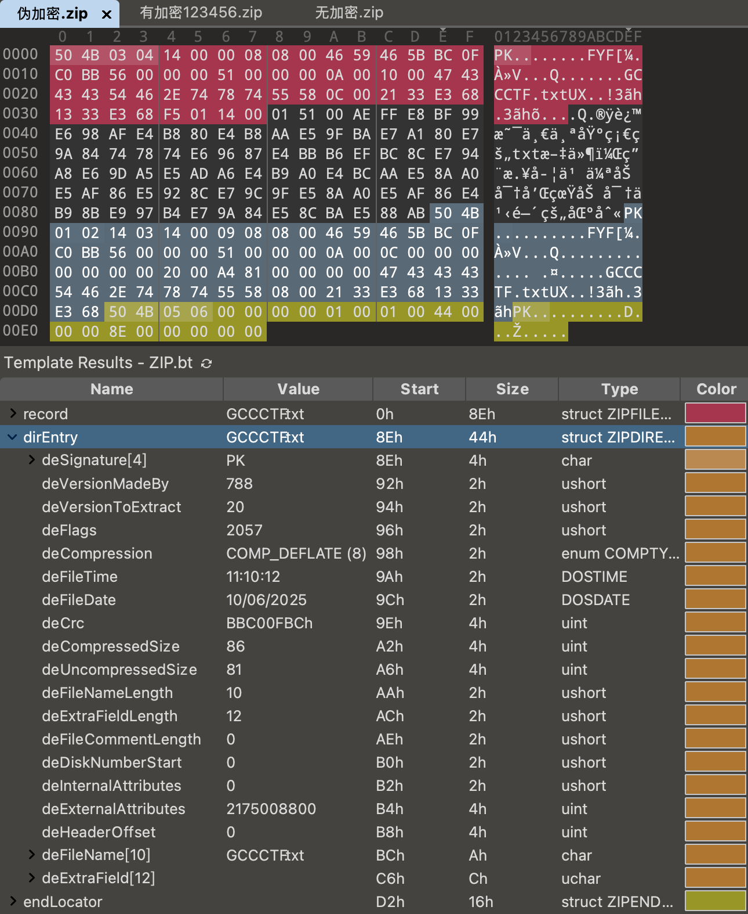

无加密
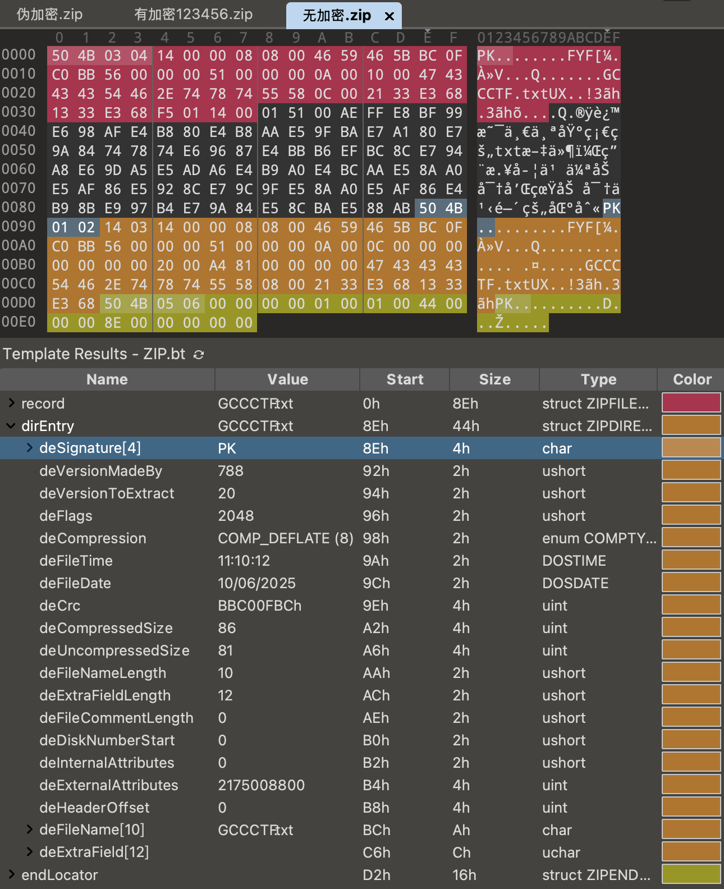

---

## 已知明文攻击

> 已知明文攻击是什么
>
> 密码分析中，已知明文攻击（Known plaintext attack）是一种攻击模式，指攻击者掌握了某段明文 x 和对应密文 y。
> 在所有密码分析中，均假设攻击者知道正在使用的密码体制，该假设称为科克霍夫假设。而已知明文攻击也假设攻击者能够获取部分明文和相应密文，如截取信息前段，通过该类型攻击获取加密方式，从而便于破解后段密文。
> 题目链接: [明文与合并](https://www.nssctf.cn/problem/5962)

> zip已知明文攻击的利用条件
>
> 1. 至少已知明文的12个字节及偏移，其中至少8字节需要连续。
> 2. 明文文件需要被相同的压缩算法标准压缩（也可理解为被相同压缩工具压缩）
> 3. 明文对应文件的加密算法需要是 ZipCrypto Store
> 题目链接: [[GHCTF 2025]mybrave](https://www.nssctf.cn/problem/6535)

---

> 什么是CRC32碰撞
> 
> CRC 本身是「冗余校验码」的意思，CRC32 则表示会产生一个 32 bit ( 8 位十六进制数) 的校验值。由于 CRC32 产生校验值时源数据块的每一个 bit (位) 都参与了计算，所以数据块中即使只有一位发生了变化，也会得到不同的 CRC32 值。
> CRC32 校验码出现在很多文件中比如 png 文件，同样 zip 中也有 CRC32 校验码。值得注意的是 zip 中的 CRC32 是未加密文件的校验值。

> **CRC32碰撞攻击原理：**
> 
> 1. **基础原理**：CRC32是一个32位的校验值，理论上有2^32种可能的值。当文件内容很短时（如4字节），可能的明文组合数量有限，我们可以通过暴力枚举所有可能的明文来找到与目标CRC32值匹配的内容。
> 2. **算法流程**：
>    - 获取加密zip文件中的CRC32校验值
>    - 根据文件大小确定可能的字符集（通常是可打印字符）
>    - 枚举所有可能的明文组合
>    - 计算每个组合的CRC32值
>    - 找到与目标CRC32匹配的明文
> 3. **攻击条件**：
>    - 文件内容很少（一般比赛中大多为 4 字节左右）
>    - 加密的密码很长（暴力破解不现实）
>    - 已知文件的CRC32校验值
> 4. **时间复杂度**：对于n字节的文件，如果字符集大小为k，则需要枚举k^n种可能，当n较小时这是可行的。

可以使用的工具：[CRC32-Tools](https://github.com/AabyssZG/CRC32-Tools)
题目链接：[[MoeCTF 2022]cccrrc](https://www.nssctf.cn/problem/3305)

---

### 图片格式介绍

> 图像文件与黑客文化联系紧密，CTF 竞赛中常见各类图片相关题目。
> 图像格式多样（如 PNG、JPEG、GIF、BMP），涉及元数据、信息丢失/无损压缩、校验、隐写与可视化编码等分析方向，均为 Misc 的重要出题点。相关知识面较广（文件格式、隐写手法与工具），部分内容需要更深入的理解与练习。

---

> 不管是什么格式，或采用什么样的压缩标准，原始的图像数据其实都是一样的，而且也符合我们直观的理解。
> 例如，一张 4 × 4 （宽度和高度都是 4 个像素）的彩色图片，未压缩的的原始图像数据，就是一个 4 × 4 矩形网格，每一个网格代表一个像素。
> 而彩色图片的每一个像素，又是由 红，绿，蓝 三基色构成，如下图右边所示，红绿蓝，对应于 r g b 三个数值，也就是常说的 RGB 色彩模式。
> RGB在计算机视觉领域，又称为颜色通道，彩色图像有`三个通道值`，每个颜色通道，都是一个 0～255 的整数值，占用一个字节（Byte）的存储空间。

---

**PNG**
对于一个 PNG 文件来说，其文件头总是由位固定的字节来描述的，剩余的部分由 3 个以上的 PNG 的数据块（Chunk）按照特定的顺序组成。
文件头 `89 50 4E 47 0D 0A 1A 0A + 数据块 + 数据块 + 数据块`……
数据块 CHUNK
PNG 定义两类数据块：关键数据块（critical chunks）与辅助数据块（ancillary chunks）。关键数据块中有 4 个标准块，每个 PNG 文件都必须包含（PLTE 可选），PNG 读写软件必须支持这些数据块。

---

<!-- _class:  navbar -->

| 数据块符号 | 数据块名称 | 多数据块 | 可选否 | 位置限制 |
| --- | --- | --- | --- | --- |
| `IHDR` | 文件头数据块 | 否 | 否 | 第一块 |
| cHRM | 基色和白色点数据块 | 否 | 是 | 在 PLTE 和 IDAT 之前 |
| gAMA | 图像 $\gamma$ 数据块 | 否 | 是 | 在 PLTE 和 IDAT 之前 |
| sBIT | 样本有效位数数据块 | 否 | 是 | 在 PLTE 和 IDAT 之前 |
| **PLTE** | 调色板数据块 | 否 | 是 | 在 IDAT 之前 |
| bKGD | 背景颜色数据块 | 否 | 是 | 在 PLTE 之后 IDAT 之前 |
| hIST | 图像直方图数据块 | 否 | 是 | 在 PLTE 之后 IDAT 之前 |
| tRNS | 图像透明数据块 | 否 | 是 | 在 PLTE 之后 IDAT 之前 |
| oFFs | (专用公共数据块) | 否 | 是 | 在 IDAT 之前 |
| pHYs | 物理像素尺寸数据块 | 否 | 是 | 在 IDAT 之前 |
| sCAL | (专用公共数据块) | 否 | 是 | 在 IDAT 之前 |
| `IDAT` | 图像数据块 | 是 | 否 | 与其他 IDAT 连续 |
| tIME | 图像最后修改时间数据块 | 否 | 是 | 无限制 |
| tEXt | 文本信息数据块 | 是 | 是 | 无限制 |
| zTXt | 压缩文本数据块 | 是 | 是 | 无限制 |
| fRAc | (专用公共数据块) | 是 | 是 | 无限制 |
| gIFg | (专用公共数据块) | 是 | 是 | 无限制 |
| gIFt | (专用公共数据块) | 是 | 是 | 无限制 |
| gIFx | (专用公共数据块) | 是 | 是 | 无限制 |
| `IEND` | 图像结束数据块 | 否 | 否 | 最后一个数据块 |

---

对于每个数据块都有着统一的数据结构，每个数据块由 4 个部分组成

| 名称 | 字节数 | 说明 |
| :---: | :---: | :--- |
| **Length** (长度) | 4 字节 | 指定数据块中数据域的长度，其长度不超过 $(2^{31}-1)$ 字节 |
| **Chunk Type Code** (数据块类型码) | 4 字节 | 数据块类型码由 ASCII 字母 (A - Z 和 a - z) 组成 |
| **Chunk Data** (数据块数据) | 可变长度 | 存储按照 Chunk Type Code 指定的数据 |
| **CRC** (循环冗余检测) | 4 字节 | 存储用来检测是否有错误的循环冗余码 |

CRC（Cyclic Redundancy Check）域中的值是对 Chunk Type Code 域和 Chunk Data 域中的数据进行计算得到的。

---

- 文件头数据块 IHDR（Header Chunk）：它包含有 PNG 文件中存储的图像数据的基本信息，由 13 字节组成，并要作为第一个数据块出现在 PNG 数据流中，而且一个 PNG 数据流中只能有一个文件头数据块
- 其中我们主要关注的是前 8 字节的内容
  - Width	4 bytes	图像宽度，以像素为单位
  - Height 4 bytes	图像高度，以像素为单位

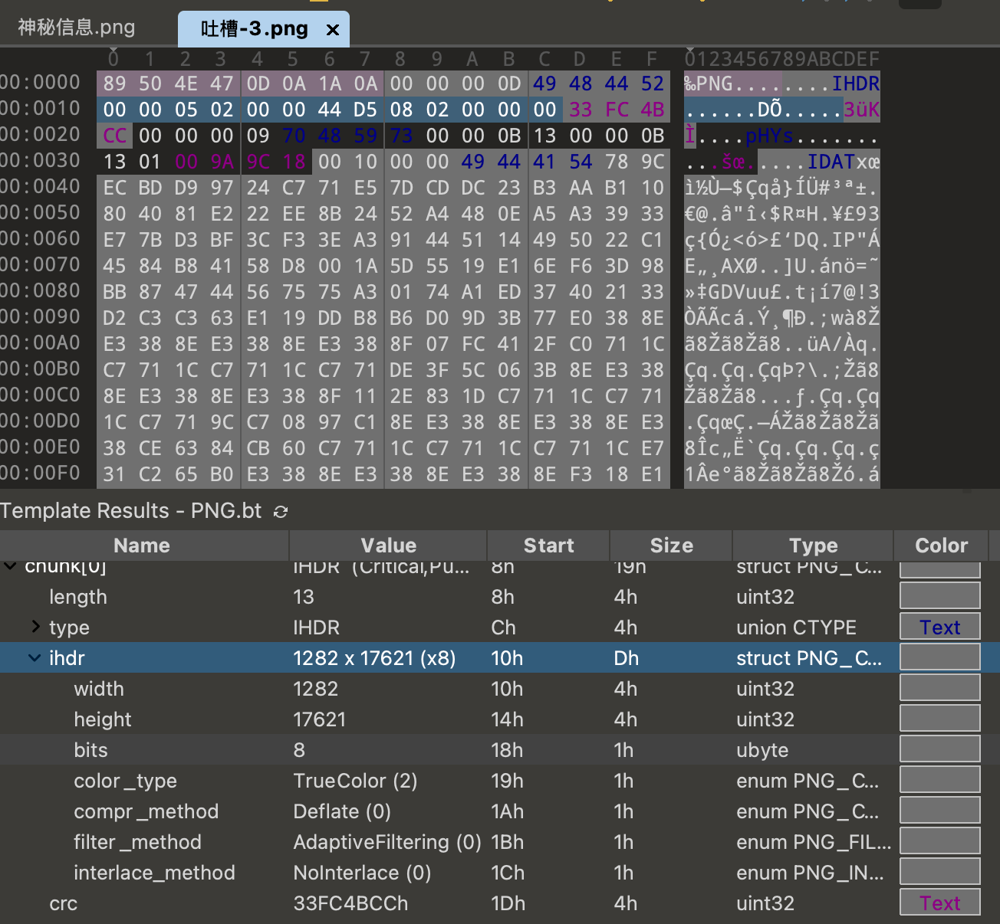

- 图像数据块 IDAT（image data chunk）：它存储实际的数据，在数据流中可包含多个连续顺序的图像数据块。
  - 储存图像像素数据
  - 在数据流中可包含多个连续顺序的图像数据块
  - 采用 LZ77 算法的派生算法进行压缩
  - 可以用 zlib 解压缩
- 值得注意的是，IDAT 块只有当上一个块充满时，才会继续一个新的块。

IEND
图像结束数据 IEND（image trailer chunk）：它用来标记 PNG 文件或者数据流已经结束，并且必须要放在文件的尾部。
`00 00 00 00 49 45 4E 44 AE 42 60 82`
IEND 数据块的长度总是 00 00 00 00，数据标识总是 IEND 49 45 4E 44，因此，CRC 码也总是 AE 42 60 82。

---

**JPEG**

文件结构：
- JPEG 是有损压缩格式，将像素信息用 JPEG 保存成文件再读取出来，其中某些像素值会有少许变化。在保存时有个质量参数可在 0 至 100 之间选择，参数越大图片就越保真，但图片的体积也就越大。一般情况下选择 70 或 80 就足够了
- JPEG 没有透明度信息

JPEG 基本数据结构分为两类：「段」与经过压缩编码的图像数据：
- 有些段没有长度描述也没有内容，只有段标识和段类型。文件头和文件尾均属于这种段。
- 段与段之间无论有多少 FF 都是合法的，这些 FF 称为「填充字节」，必须被忽略掉。
- 0xFFD8 与 0xFFD9 为 JPEG 文件的开始与结束标志

一些常见的段类型

一个 JPEG 图片的十六进制示例

---

**GIF**

- 一个 GIF 文件的结构可分为
  - 文件头（File Header）
    - GIF 文件署名（Signature）
    - 版本号（Version）
  - GIF 数据流（GIF Data Stream）
    - 控制标识符
    - 图象块（Image Block）
  - 其他的一些扩展块
    - 文件终结器（Trailer）

下图展示了一个 GIF 文件的组成结构：

中间的那个大块可以被重复任意次

**GIF 的数据块**

文件头
GIF 署名（Signature）和版本号（Version）。GIF 署名用来确认一个文件是否是 GIF 格式的文件，这一部分由三个字符组成：GIF；文件版本号也是由三个字节组成，可以为 87a 或 89a。

逻辑屏幕标识符（Logical Screen Descriptor）
Logical Screen Descriptor（逻辑屏幕描述符）紧跟在 header 后面。这个块告诉 decoder（解码器）图片需要占用的空间。它的大小固定为 7 个字节，以 canvas width（画布宽度）和 canvas height（画布高度）开始。

全局颜色列表（Global Color Table）
GIF 格式可以拥有 global color table，或用于针对每个子图片集，提供 local color table。每个 color table 由一个 RGB（就像通常我们见到的（255，0，0）红色 那种）列表组成。

图像标识符（Image Descriptor）
一个 GIF 文件一般包含多个图片。之前的图片渲染模式一般是将多个图片绘制到一个大的（virtual canvas）虚拟画布上，而现在一般将这些图片集用于实现动画。

每个 image 都以一个 image descriptor block（图像描述块）作为开头，这个块固定为 10 字节。

图像数据（Image Data）
终于到了图片数据实际存储的地方。Image Data 是由一系列的输出编码（output codes）构成，它们告诉 decoder（解码器）需要绘制在画布上的每个颜色信息。这些编码以字节码的形式组织在这个块中。

文件终结器（Trailer）
该块为一个单字段块，用来指示该数据流的结束。取固定值 0x3b.

更多参见 [gif 格式图片详细解析](http://www.jianshu.com/p/df52f1511cf8)

---

## 图片相关题目工具推荐

[tweakpng](https://entropymine.com/jason/tweakpng)—>快速查看png图片的块信息

[stegsolve-java环境](https://github.com/Giotino/stegsolve)—>快速查看图片的隐写信息lsb|gif帧分离

[Arnold变换爆破工具](https://github.com/aristorechina/arnold_decoder)

大佬的脚本：[Deformed-Image-Restorer](https://github.com/AabyssZG/Deformed-Image-Restorer.git)

---

## 4. 图片相关题目

---

## 宽高隐写

学习 PNG 时，IHDR 块包含图片的宽度与高度。出题者可能通过修改 IHDR 的宽高实现隐写：在 Windows 自带看图工具中会按 IHDR 显示宽高，修改后可能导致信息被隐藏或错位。部分软件或系统在打开时会校验 CRC 值，若 CRC 不正确则可能报错或无法打开。
题目链接:
- [PNG高度修复](https://www.nssctf.cn/problem/4324)
- [PNG宽高修复](https://www.nssctf.cn/problem/4325)
JPEG 或 BMP 也存在“宽高隐写”的思路，同理需要修改相应的宽高比特位。
题目链接：
- [JPG宽高修复](https://www.nssctf.cn/problem/4326)
- [BMP宽高修复](https://www.nssctf.cn/problem/4327)

---

## LSB隐写

LSB（Least Significant Bit）隐写将隐藏信息嵌入到图像的最低有效位。在 PNG 存储中，每个颜色分量为 8 bit，对应 256 种取值；RGB 三通道总计 256^3=16,777,216 种颜色。人眼可区分约千万级颜色，剩余差异通常难以察觉，因此在最低有效位嵌入数据通常不易被肉眼发现。

 

题目链接：
- [LSB隐写1](https://www.nssctf.cn/problem/4440) 
- [LSB隐写2](https://www.nssctf.cn/problem/4441)

---

## GIF分离

GIF 与视频可视作由多帧图片构成。对变化较快的 GIF，可分离各帧以获取可能隐藏在某一帧中的信息。

题目链接：
- [GIF分离](https://www.nssctf.cn/problem/4442)

---

## Exif 信息

> 可交换图像文件格式（英语：Exchangeable image file format，官方简称Exif），是专门为数码相机之照片设定的文件格式，可以记录数码照片的属性信息和拍摄数据
> Exif可以附加于JPEG、TIFF、RIFF等文件之中，为其增加有关数码相机拍摄信息的内容和索引图或图像处理软件的版本信息。

题目链接：
- [Exif信息隐写](https://www.nssctf.cn/problem/507)

---

## 参考资料

- [Hello-CTF 官网](https://hello-ctf.com/)
- [CTF-Wiki 官网](https://ctf-wiki.org/)
- [gif 格式图片详细解析](http://www.jianshu.com/p/df52f1511cf8)