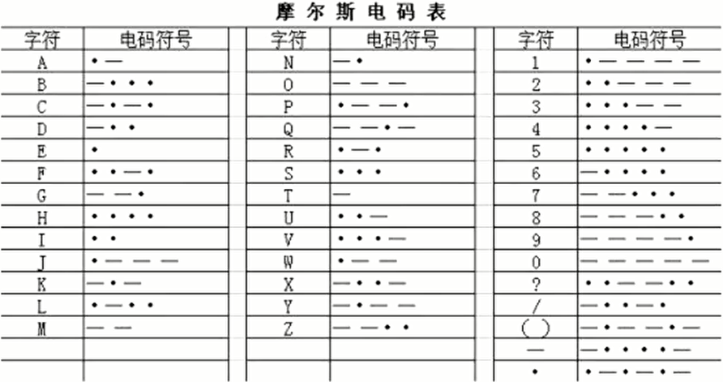
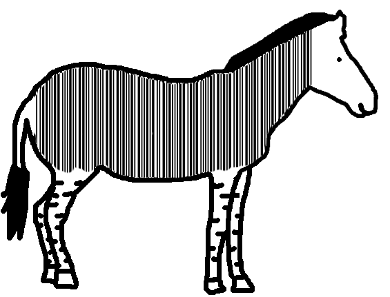

# MISC之信息搜集与编码分析


# MISC

**MISC = miscellaneous 杂项 大杂烩**

- 所有无法归入CTF主流类别的技能挑战

- 作用
  - 基础知识 
  - 技能面 
  - 逆向思维
  - 密码学
  


## 信息搜集

- 科学上网

- 地图和街景搜索
  - 国外：Google Map、Earth
  - 国内：百度地图、腾讯地图（卫星视图、全景视图）

- 网络世界到物理世界
  - IP2Location
  - [纯真数据库](https://github.com/itbdw/ip-database)
    


### 示例
 


 


 

 

# 编码分析

### 通信领域常见编码

- 电话拨号

  - 1-9 分别使用 1-9 个脉冲，0 则表示使用 10 个脉冲

- Morse编码
  - 摩尔斯电码（又译为摩斯密码，Morse code）是一种时通时断的信号代码。
  

```
通过不同的排列顺序来表达不同的英文字母、数字和标点符号。
摩尔斯电码由两种基本信号组成：
短促的点信号“.”，读“滴”；保持一定时间的长信号“—”，读“嗒”。
```
  - 特点：最多六位，只有-和.，也可以用01串表示

  
  
  
  **题目：**-... -.- -.-. - ..-. -- .. ... -.-.
  

### 计算机领域常见编码

- 二进制01编码

- Hex十六进制编码

  - 00-FF
  - 十六进制（简写为hex或下标16）在数学中是一种逢16进1的进位制。一般用数字0到9和字母A到F（或a ~ f）表示，其中:A ~ F表示10 ~ 15，这些称作十六进制数字。


- ASCII编码

  - 我们一般使用的 ascii 编码的时候采用的都是可见字符，而且主要是如下字符
    - `0-9`, 49-57
    - `A-Z`, 65-90
    - `a-z`, 97-122
    - `{`  `}`,123/125


  
  
 [在线解码工具](http://www.ab126.com/goju/1711.html)

**题目：掀桌子** 


### Base家族

- Base64编码

  - 基于64个可打印字符来表示二进制数据的表示方法

  - 字符集：大小写字母各26个、10个数字、加号"+"、斜杠 ”/ “、一共64个字符。等号” = “作为后缀用途
  ```
  每3个字符由4个可打印字符表示。
  若原数据长度不是3的倍数且剩下1个输入数据，则在编码结果后加两个=，
  若剩下两个数据，则在编码结果后加一个=  
  ```
  - 特征:大小写一串，可能有 = +


- Base32

  32个可打印字符，A ~ Z、2 ~ 7 、32个可打印字符，“=”符号用作后缀填充
  ```
  若原数据长度不是5的倍数时且剩下1个输入数据，则在编码结果后加4个=;
  若剩下2个输入数据，则在编码结果后加3个=，以此类推。
  
  特征:只有大写字符，可能有= 
  ```

- Base16

  16个可打印字符，A ~ F、0 ~ 9，16个可打印字符。

- Base58

  相比Base64，Base58不使用数字"0"，字母大写'O'，字母大写'I'，和字母小写'l'，以及"+"和"/"符号


  ```
  Base家族特征：
  Base64 结尾可能会有 = 号，但最多有 2 个
  Base32 结尾可能会有 = 号，但最多有 6 个
  有可能需要自己加等号
  ```

  [Base家族示例]()
  **题目示例**:base64÷4

### 现实世界常见编码

- 条形码
    - 宽度不等的多个黑条和空白，按照一定的编码规则排列，用以表达一组信息的图形标识符
    - 国际标准
      - EAN-13 商品标准，13 位数字
    - Code-39：39 字符
    - Code-128：128 字符
    - [在线工具](https://online-barcode-reader.inliteresearch.com/)

   **题目示例**：Banmabanma





- 二维码
     

  - 二维码物理问题
     


      

  - 二进制二维码
    - 题目给出了一段全是01的数字串，且数字的长度为一个整数的平方（如25^2=625）时，有可能是以0、1表示黑或者白的一个像素，可以生成一个正方形的像素图。


  - 二维码隐藏信息
      - 二维码识别工具QR_Research
     


  ```
   "flag"
   
   01100110 01101100 01100001 01100111（二进制）
   146 154 141 147 （八进制）
   102 108 97 103 （十进制）
   66 6c 61 67 （十六进制）
   ZmxhZ==（base64）
   MZWGCZ（base32）
   synt（rot13）
   …-. .-… .- --.（莫斯码）
   21 31 11 22（敲击码）
  ```


### 其他编解码
 - [佛曰](http://www.keyfc.net/BBs/tools/tudoucode.aspx)
 
 - [颜文字AAEncode](http://www.atoolbox.net/Tool.php?Id=703)

 - [rot-13](https://www.jisuan.mobi/puzzm6z1B1HH6yXW.html)
   - `ROT13`（回转13位，rotateby13places，有时中间加了个减号称作ROT-13）是一种简易的置换暗码。它是一种在网路论坛用作隐藏八卦、妙句、谜题解答以及某些脏话的工具。
  
- [其他](http://ctf.ssleye.com/)
  

### 参考链接：
- https://www.freebuf.com/column/228957.html

- https://www.pianshen.com/article/9976694150/

- https://wiki.x10sec.org/
  
- https://blog.csdn.net/x947955250/article/details/81304430

- https://www.bilibili.com/video/BV1RK4y1t733?p=9&t=531
  
- https://cli.im/news/help/10601
 

  
   