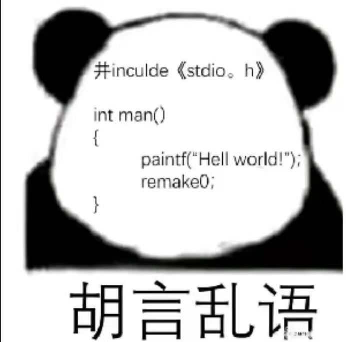
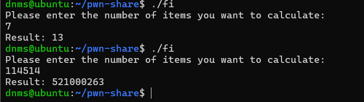

# 0x01 C语言基础

## Before learning

**本教程涉及的所有技术手段以及资料，仅用于学习和交流目的，不得以任何形式利用其参与违法违规活动！**

## 什么是编程

常用的部分编程语言（不分先后顺序）

- 高级编程语言

	- C

		> 请叫我祖宗

	- Cpp（C++）

		> C语言的plus版本，面向对象，更方便做大型项目

	- Python

		> 至简，编程速度快如闪电，运行速度慢如蜗牛

	- Java

		> 谁说Java工程师没有就业去向的？？

	- php

		> 毕业了也只学会一句phpinfo();（开玩笑

- 汇编语言

	> 最原始的力量！give me 抛瓦！！！

- 机器码（bushi

	> 其实就一串01，还能算编程语言......吗?

## C语言基础

C语言的一些特点

- 最底层

> C语言是最基础最底层的高级编程语言，甚至如windows的操作系统都是C编写的

- 极致的性能

> C语言运行速度极快，如丝般顺滑~

- 可以对内存直接访问

> 指针与地址，又是谁的一辈子TuT

- 巨巨巨多的库可供使用

> 库文件就是别人写好的程序，你可以直接使用在你编的程序里，极其方便~

### IDE集成开发环境

想要写一个程序，并且生成一个可以运行的应用程序，那么就需要一个开发环境

这里推荐Visual Studio 2022，由于时间限制，从安装到配置请自行百度~

或者可以看这一篇，写的很详细~

[https://blog.csdn.net/InnerPeaceHQ/article/details/121716088](https://blog.csdn.net/InnerPeaceHQ/article/details/121716088)

### 第一个程序

那么有了IDE，我们就可以正式开始编程了~

在正式编程之前，请注意你在编写程序时使用的所有符号，***均为英文符号***，请注意！！！



这里先跟着我写~稍后会讲

```c
#include<stdio.h>

int main()
{
	printf("Hello World!");
    return 0;
}
```

点击运行，你会发现在命令行里，这个程序向你说了一句"Hello World"

#### 对每一行内容的解释

C语言的`#`代表宏定义，是一种“出厂设置”，是对你这个程序的初始化，可能包含初始化你需要的库（以head文件xxx.h的形式）、对某些数值起个名字方便快速调用

> 上述 对这些数值起的“名字”，其实就是 **变量** 的定义：变量就是一种方便编程人员存储和操作数据的逻辑上的空间，是一种可变的“参数”，而用`#`初始化的参数是宏常量，不可变，仅仅便于开发人员记忆和书写

```c
#include<stdio.h> //我们这个程序需要用到的库文件，是和命令行交互的I/O相关库文件
```

```c
int main()
{
    
}
//main函数，即你开发的主程序，int代表integer，表明了这个函数的输出（也叫做返回值）是一个整数类型，小括号()里填输入参数(有些函数可以没有)，大括号里{}填程序内容，每个C语言程序都必须要有的模块
```

**数据类型**

> 除了整型int(integer)，还有字符型char(character)，单浮点型float(小数)，双浮点型double(更精确的小数)，布尔型bool(值为“是”或“否”，也表示为1或0)......

**函数的定义**

>  函数是个啥？你可以理解为 用来实现某个功能的程序片段，可以是 输入-处理-输出的形式，例如我在下面 **定义** 一个加法函数（注意是定义，和调用不同）

```c
int add(int parameter1, int parameter2)//()括号内写输入的参数，这里需要两个输入参数，参数类型是int整数类型
//下面的大括号{}里面写这个函数体的程序
{
    int result;//c语言的每个*完整*语句都需要分号;作为结尾，这里使用int定义了一个整数类型的变量叫做"result"
    result = parameter1 + parameter2;//c语言里的等号=是赋值的意思，把 后面的变量或者表达式的值 赋值给前面的变量
    
    return result;//用return来标志着这个函数的终止，程序的输出结果为return的值，这里是变量result的值
}
```

**函数的调用**

>   当我想使用这个函数时只需要用 `函数名`+`(参数)` 即可，例如想要调用上述函数：

```c
int a = 123;//这里在声明变量a时直接为它赋值为123，是int a; a = 123;的缩写、
int b = 345;
int c;
c = add(a, b);//这里调用了add()函数，输入参数为(a, b)，同时把变量c赋值为add函数的返回值
```

>   现在再来看我们刚刚写的程序，我们定义了这个程序的main()函数，main()函数里调用了一个printf()函数，printf()函数的参数是一串文字，这里的每一个文字都是一个字符，串在一起就叫做字符串，实际上这个参数就是一个字符串类型的参数，这里printf()函数的功能，就是向命令行打印参数传递进来的这个字符串

### 进阶

那么接下来再一起写一个程序，来计算两个数分别x3和x5之后相加的结果

这里要用到另外一个函数：scanf()，用来从命令行读取内容

```c
#include<stdio.h>

int calculate(int parameter1, int parameter2)
{
    int result = parameter1 * 3 + parameter2 * 5;
    return result;
}

int main()
{
    int a;
    int b;
    scanf("%d", &a);//%d，%c，%s这一类控制字符叫做占位符，占位符会有各种类型，%d是整数类型，%s是字符类型...可以自行百度。
    scanf("%d", &b);//当这个函数读取到%d的时候，会自动从前往后读取函数的其它参数，把遇到的参数依次往占位符处填充
    //&符号叫 取地址符，用于读取变量存储的具体内存位置
    //这句函数的实际意思就是 以整数类型 读取命令行里用户的输入 并把用户的输入存储进 变量a 的存储空间（我们把存储空间叫做地址）里
    //这里scanf函数规定的是参数以 地址类型 输入，所以我们需要用取地址符 来 拿到变量a的地址 如此才能把a赋值为读取的数据
    
    int c = calculate(a, b);//这里调用calculate()函数，传入刚刚读取到的a和b作为参数
   	printf("The calculation result is: %d", c);//这里printf同样需要用占位符%d来向字符串里插入我们希望输出的变量c
    
	return 0;
}
```

### 再进阶

我希望使用程序完成一个更复杂的任务：

> 读取两个数如果前者a大于b就计算$a\times 3+b\times5$，等于就计算$a\times4 + b\times 4$，小于计算$b\times3 + a\times5$
>
> 很显然这种需要进行逻辑条件判定的功能以上述功能并不能实现

#### 条件语句

这时候我们需要条件语句`if(){}`、`else{}`、`else if(){}`

> 这个相比函数以及循环的概念，基本上等于英语直译，应该很容易理解~

继续编写程序~注意不要copy，尽可能重复性的手写，有助于快速记忆

```c
#include<stdio.h>

int calculate(int para1, int para2)
{
    int c;
	if (para1 < para2)
    {
        result = para2 * 3 + para1 * 5;
    }
    else if (para1 == para2)
    {
        result =  para1 * 4 + para2 * 4;
    }
    else
    {
        result = para1 * 3 + para2 * 5;
    }

    return result;
}

int main()
{
    int a, b;//这里实际上是int a; int b;的缩写，同一类型的变量可以在同一行里声明，用逗号,隔开
    scanf("%d %d", &a, &b);//这里同样是前面进阶程序里两个scanf的等效缩写
    int c = calculate(a, b);
    printf("The calculation result: %d", c);
	return 0;
}
```

 这个程序实际上并不能体现机器执行程序相较人脑计算的优越性，那么我们给出以下的任务：

### 最终难度

请你计算 **斐波那契数列** 第114514个元素的值（好臭的数字......

> 这时候如果开发人员若是每一个元素都手写一遍未免也太......

#### 循环语句

为了完成重复性/多次的流程，我们这里运用到循环语句`while()`，`for()`

用法这里直接给出，各位初学的朋友一定要课余时间**多做练习！！**

```c
while(条件或表达式)//意思为：当该条件成立 或 该表达式值不为0 时，会一直执行循环体内的程序
{
	//循环体，常常搭配break; continue; 等控制语句进行控制
    //break语句在执行时会立即跳出当前循环
    //continue语句在执行时会立刻跳过循环体内的后续语句，而跳回循环体第一行语句，相当于直接执行下一轮循环
}

//举例：
int a = 0;
int sum = 0;
while(a < 6)//括号内的条件会在每次新循环开始时检查，当a>=6时不再进入新循环
{
	sum = sum + a;//现在变量sum 被赋值为 原先的sum值 + a的值
    a = a + 1;//现在的a 被赋值为 原先a的值 + 1，相当于每一轮循环递增1
}//这个程序实现的功能是 把从 1到5 的整数和 赋值给sum

for(声明循环控制变量;循环条件;对循环控制变量的操作)
{
    //循环体
    //break; continue; 等控制语句在for循环里仍然可用
}

//举例：
int sum = 0;
for(int round=1;round<6;round++)// round++; 语句为round = round + 1; 的等效缩写，在每轮循环执行完毕后会执行*这条*循环控制变量操作的语句，++ :自增
{
    sum += round;//是 sum = sum + round; 语句的等效缩写
}

int round;
for(round=1;round<6;round++)
{

}


//break和continue语句的举例：
int a, sum = 0;
while(a<20)
{
    if(sum >= 15)
    {
		break;
    }
	if(a%2 == 0)//%操作符为"取余数", 即取 a除以2的余数; 双等于号==意为"是否等于"
    {//上述条件的意思为：如果a为偶数则执行
		sum += a;
    }
    a++;
}

//上述程序实现的功能为 取 所有20以下的偶数的和，如果加上第n个数时超过15，则取前n个偶数的加和，将这个和赋值给sum变量
```

于是有了上述知识，我们就可以尝试开始完成上述任务！

各位新手朋友一定要自己动手

```c
#include<stdio.h>

int fibonacii(int target)
{
    int i = 1;
    int i_before = 0;
    //第round轮计算完成之后，实际上i的值是第round+1项的值，因此这里需要循环*target-1*轮
    for(int round=1;round<target;round++)
    {
        int temp = i;//这里因为需要暂时保存
        i = i_before + i;
		i_before = temp;
    }
	return i;
}

int main()
{
    int target;
    printf("Please enter the number of items you want to calculate: \n");
    //像"\n"这类的转义字符用于表示不可视的字符，'\n'表示回车符
    scanf("%d", &target);
    int result = fibonacii(target);
    printf("Result: %d\n", result);
	return 0;	
}
```

写完之后可以自己写一个输入输出的测试样例进行测试，没有问题之后就可以将程序投入计算啦~

```
斐波那契数列前10项：1, 1, 2, 3, 5, 8, 13, 21, 34, 55
输入样例1:
7
输出样例1:
13

输入样例2:
10
输出样例2:
55
```



### 个人挑战

- [ ] 自己重新写一遍Hello World
- [ ] 更改进阶程序的计算函数，让它可以处理三个传入参数，将这三个参数分别x3/x5/x8加和输出
- [ ] 更改进阶程序的main()函数，使得它可以从命令行读取三个整数并计算上述表达式，并输出
- [ ] 自己写一个任意从命令行读取 两个整数 和 一个字符，这个字符可以是`+`或`-`或`*`或`/`，输出对两个数进行对应四则运算的计算结果
- [ ] 自己写一个循环程序，实现计算斐波那契数列的前800项和

### 题外话

本教程由于时间限制，讲解得实际上是极其简洁的，甚至于有一些必要的知识点没有被提及。事实上，如果你希望对C语言掌握得比较好，你仍然需要细致、系统性的学习 以及 **大量的实践练习**

这里把本章教程需要掌握的内容列举出来，可能需要花费你8h左右的时间学习、积累并逐渐巩固以下知识点

### 知识清单

- [ ] 变量（声明、赋值、**一元**和二元运算符）
- [ ] 数据基本类型**及其所需存储空间**（这个本教程未曾提及，但很重要，需要自行百度~）
- [ ] 表达式与运算符（多用多写很容易记忆）
- [ ] 头文件
- [ ] 条件与**循环语句**（很难！需要花时间练习！）
- [ ] **函数**（很重要）
