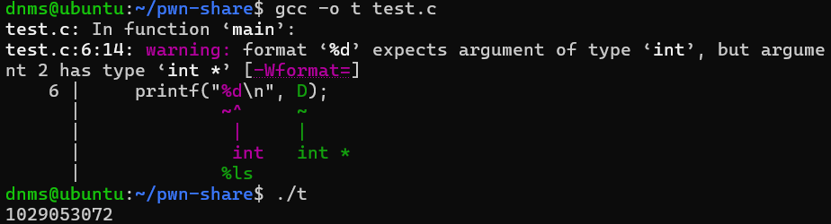
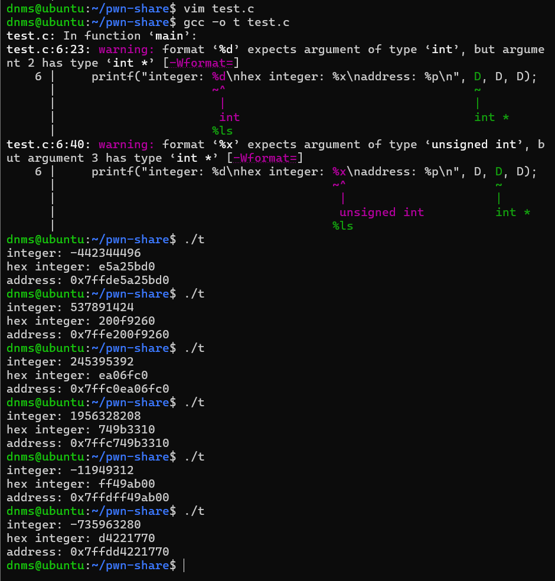
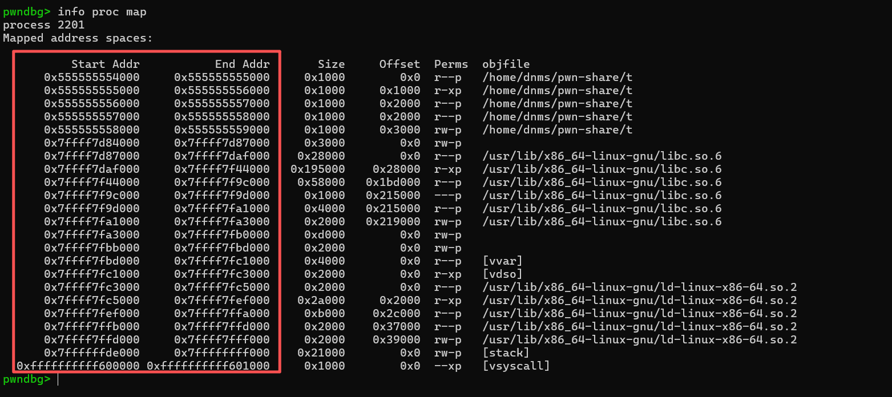
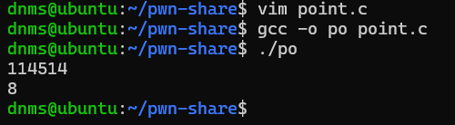
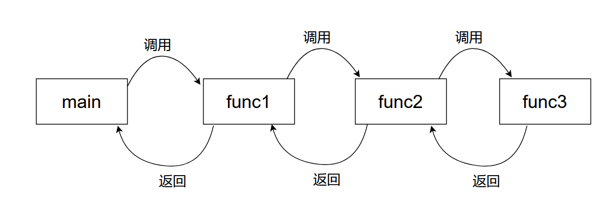

# 0x03 C语言进阶

恭喜各位朋友已经对C语言有了一个初步的认识

那么接下来，你将会接触到C语言地狱级难度的部分~

## C语言的数组、地址、指针、控制流与系统调用

### 上集回顾

回顾一下Episode 0x01，我们写了一个计算斐波那契数列特定项对应值的程序

```c
#include<stdio.h>

int fibonacii(int target)
{
    int i = 1;
    int i_before = 0;
    //第round轮计算完成之后，实际上i的值是第round+1项的值，因此这里需要循环*target-1*轮
    for(int round=1;round<target;round++)
    {
        int temp = i;//这里因为需要暂时保存
        i = i_before + i;
		i_before = temp;
    }
	return i;
}

int main()
{
    int target;
    printf("Please enter the number of items you want to calculate: \n");
    //像"\n"这类的转义字符用于表示不可视的字符，'\n'表示回车符
    scanf("%d", &target);
    int result = fibonacii(target);
    printf("Result: %d\n", result);
	return 0;	
}
```

不知道你发现没有，我们实际上把数列的前target项都计算了，但并没能存储下来，导致哪怕是需要用到计算过的数据，都需要重新计算一遍...

那么有没有一种数据类型，能够**存储一整组**数据呢？

有的兄弟有的

### 数组

数组，就是 **存储在连续空间的一组同类型的变量**，便于存储便于取用

- 存取时直接使用 数组下标就可以找到 对应的某个元素的存储位置/值

```c
int a[50];//这句话声明了一个可以存储50个整数类型元素的数组a，数组名和*数组首地址指针*都是a，指针的定义后续会讲~
a[0] = 5;//a数组的第1项(数组下标为0，项数-1)赋值为5
a[3] = 8;//第4项赋值为8
a[8] = 33550336;
a[49] = 114514; //可以看到数组具有随机存取的性质
```

> 随机存取：当我需要第20个元素时，无需one-by-one挨个数到第20个，而是可以直接索引到第20个元素。正式描述是：可以直接访问数据结构中的任何位置，而不需要按顺序访问

搭配循环结构和数组，我们可以很好的用计算机的高频处理性能，处理很多浪费人力的工作

比如我希望使用三个数列

$A:1,2,3,4,...,n$

$B:1,3,5,7,9,...,2n-1$

$C:1,2,4,8,16,...,2^{n-1}$

计算

$D:a_1+b_1+c_1,a_2+b_2+c_2,a_3+b_3+c_3,...,a_n+b_n+c_n$

的前n项并输出（n<100），就可以用以下的程序来完成

各位新手朋友可以一起操作，尽量手写勤加练习~

``` c
#include<stdio.h>

int expo(int base, int exp)//这里需要我们手写一个幂函数，
{						   //注意这个幂函数没有处理exp为负数时的逻辑，不能处理负数输入
    int result = 1;
    //一共执行指数轮循环，每轮循环乘以一次底数，共指数个底数相乘，即 底数的指数次幂
    for(int i=1;i<=exp;i++)
    {
        result = result * base;
    }
    return result;
}
int main()
{
    int n;
    scanf("%d", &n);
    int D[100] = {0};
    for(int i=0;i<n;i++)//从数组下标为0开始存储
    {
		D[i] = (i+1) + (2 * (i+1) - 1) + expo(2, (i+1)-1);
        //没有现成幂计算运算符，需要自己实现
        //由于i从0开始，会导致数组首项为D[0]= 0 + 2*0-1 + 2^(0-1)，出现错位
        //因此需要在数组下标为i时，使用各数列的第i+1项，这样才能避免错位发生
    }
    printf("%d %d\n", D[n-1], D[m-1]);//第n项、m项数组下标分别为n-1、m-1
	return 0;						  //(因为数组下标从0开始)
}
 
```

不知道你会不会有这样的好奇：

我们上述写了一个数组D（下面给出前五项）

```c
int D[5] = {3, 7, 12, 19, 30};
```

如果我们打印出来D这个变量会是什么情况呢？

```c
printf("%d\n", D);
```



我们发现输出了一串根本读不懂的数字...这是为什么呢？

我们开始用不同格式的方式输出

```c
printf("integer: %d\nhex integer: %x\naddress: %p\n", D, D, D);
```

发现输出结果如下



我们可以看到，每一次执行，整数格式和hex格式都在发生无规律的变化，但我们发现：

- address的后8位数字，永远和hex(16进制的整数格式)一致，而 **计算机内存地址往往就是以16进制表示，64位系统的地址是16字节长度，32位系统地址为8字节长**

这里说明，实际上我们打印出来的**数组名**D，**其实就是一个地址**

### 地址与指针

那么我们不妨打印出来看看，这个地址到底存储的内容是什么

```c
printf("%d\n%d\n%d\n", *D, *(D+1), *(D+2));//星号*理解为 取某地址下存储的数据 即可
```


D，D+1，D+2 的地址下存储的数据，**其实就是数组D存储的数据**

不光是数组拥有地址，**所有变量 乃至于 整个程序 都要加载到 计算机内存里 才能正常运行**，因此**整个程序都有对应的地址**

我们用GDB工具打开可执行文件，可以看到程序运行过程中的实际地址。

大致计算一下，这样一个程序，需要用到30M左右的内存。



这里我们使用GDB的反汇编功能，生成了程序汇编代码，也可以找到main函数的存储地址

> 这里实际上说明，函数也拥有地址，在我们调用函数的过程中，实际上就是把这个地址交给了CPU，CPU控制程序跳转至这个函数的首地址，并把跳转之前的程序位置记录，当触发return指令时，CPU再带着返回值，控制程序跳回记录的位置，从而实现函数调用。


有细心的同学可能看到汇编代码里有一个些类似数组的语句：`PTR [rbp-0x8]`，这个`PTR`即为指针`pointer`。

>  我们知道 取地址符& 可以使用变量名获取变量存储的地址
>
> 而指针* 就是为了便于 使用地址获取存储的变量值，是对内存地址的直接操纵
>
> 实际上，数组名本质上就是一个 **指向数组首地址的指针**

```c
#include<stdio.h>
int add(int a,int b)
{
    return a+b;
}

int main()
{
    int a = 114514;
    int *var_p;//声明一个整数指针p
    var_p = &a;//指针p 指向 变量a的存储地址
    printf("%d\n", *var_p);//等效于printf("%d", a);

    int (*func_p)(int, int);//函数指针
    func_p = &add;//func_p指向add函数的地址
    //也可以简写为 func_p = add; 因为函数地址的特殊存储机制将函数名作为指向自己地址的指针
    int result = (*func_p)(3, 5);
    printf("%d\n", result);
    return 0;
}


```

执行结果，发现可以使用变量指针直接使用变量值，也可以使用函数指针直接调用指定函数



> 注意：C语言也因为 指针与地址机制会对内存直接操作这个特性，导致**极易出现漏洞**进而被攻击！
>
> 对于我们这种攻击者而言，那自然是漏洞越多越好啦~ ○( ＾皿＾)っHiahiahia…

上述我们了解了函数指针，那么接下来我们正式进入PWN的核心领域——程序的栈机制

### 程序栈

有这样一种结构，像一个弹匣一样，越先压进去的子弹 开火的时候越靠后才能发射出来，而最后压入弹匣的子弹最早打出（LIFO后进先出 Last-In-First-Out）

[弹匣](https://www.bilibili.com/video/BV1Vy4y1F7mg/) 

[队列和栈机制详解](https://www.bilibili.com/video/BV1aSDGYRE3R/) 

而我们发现：这种结构极其适合用来当作函数调用的存储结构

例如：

```c
#include<stdio.h>
void func3()
{
	return;
}

void func2()
{
    func3();
	return;
}

void func1()
{
    func2();
	return;
}

int main()
{
    func1();
	return 0;
}
```

它的调用链如下图所示



如果使用栈的结构，就会形成这样的效果：

[2. 栈溢出(25-0930更新).ppt](PPT\2. 栈溢出(25-0930更新).ppt) 

> 可以说是极其适配了~

每个程序都会开辟一块栈空间用来存放函数调用流、函数内声明的 **局部变量**

> 局部变量：定义在某个函数上的变量，存储在栈上，会随着这个函数结束 而 销毁并释放对应的存储空间
>
> 全局变量：定义在整个程序上的变量，存储在 **堆** 上，只有整个程序进程终止之后才会释放

除了栈，还有一个存储区域，叫做 **堆**，相比于栈空间，堆是巨大的，允许开发者使用`malloc()`等函数进行动态内存分配，自行开辟堆空间用来存放数据

> 但是相对的，堆内存由于开发者自主操作，不会像栈一样自动释放，因此需要开发者自行使用`free()`函数释放空间。但开发人员往往会忽略这一点，造成了大量的漏洞和性能浪费

### 系统调用

有这样一种特殊的函数，它们连接着 这个程序本身 和 操作系统，作为这个独立程序和操作系统、甚至是其他程序交互的接口

例如`system()`，参数为字符串，会直接使用命令行(shell)执行字符串内的指令

PWN手常用的**getshell**手段，就是让一个程序执行`system("/bin/sh");`语句。这条语句可以**直接开放一个shell**供攻击者交互，攻击者完成了getshell的目标，就已经成功侵入了这台执行本程序的计算机/服务器。

### 题外话

至此，我们已经把所有（至少是大多数）学习PWN方向所需的C语言基础学习完毕了

> 各位新手朋友一定要**多练习多练习多练习**，C语言需要大量的实践才能比较有效地提升理解

接下来你会借助C语言，理解计算机最底层的编程语言——汇编语言

> 准备好接受计算机世界最极致最纯粹的力量吧！

搭配C语言和汇编语言，你可以很好地分析程序逻辑、调试程序、进而挖掘程序漏洞、利用程序漏洞完成攻击

> 至是，工程已毕（bushi
> 接下来你将接触到真正的PWN！

### 知识清单

- [ ] 数组
- [ ] 地址
- [ ] 指针
- [ ] 程序栈和堆内存
- [ ] 系统调用
- [ ] 常用漏洞函数