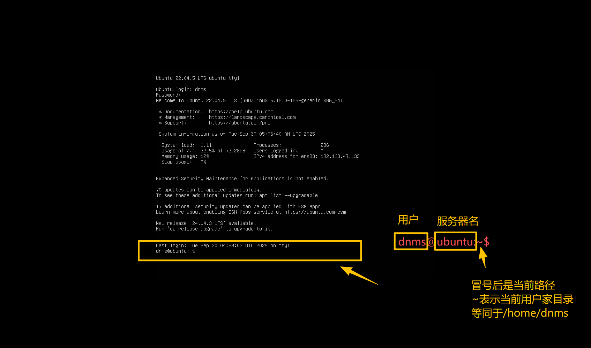
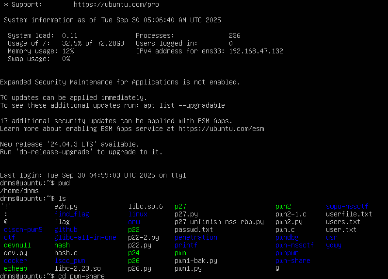
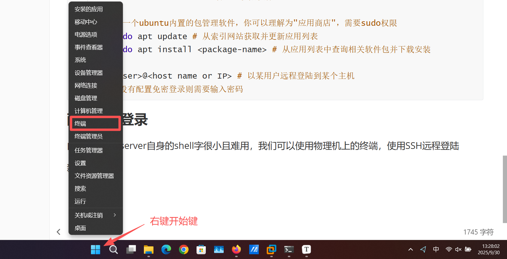
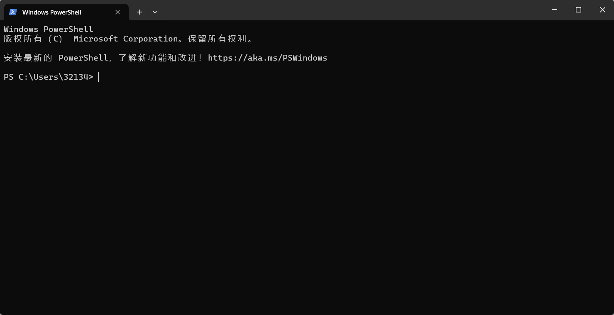
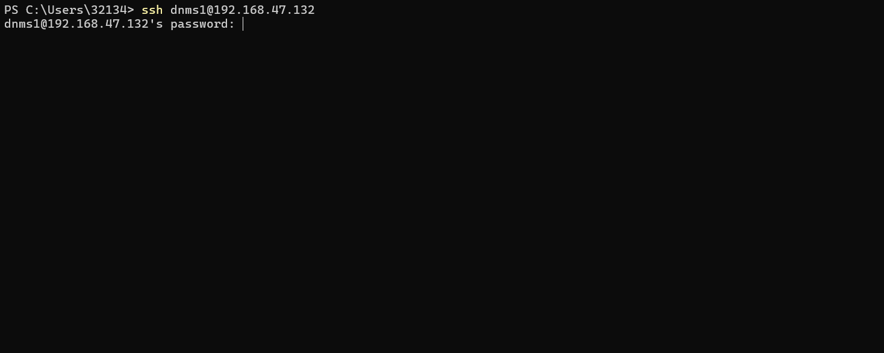
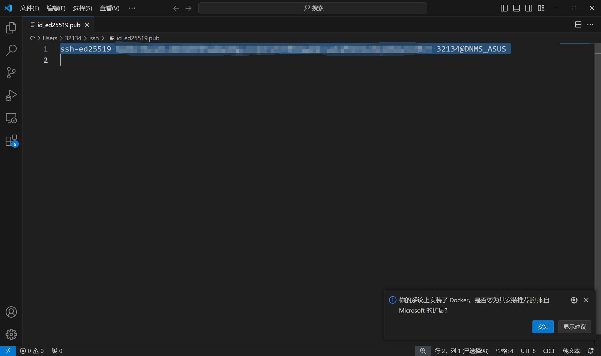

# 0x02 Linux 基础及工具

## 什么是Linux

一个 **开源、社区生态极好、应用极为广泛、极简** 的 **操作系统内核**

有许多基于Linux内核开发的 操作系统，如 **Kali**、**Ubuntu**......

> 作为安全从业人员，熟练使用Linux系统可以说是最基本的要求

由于我们现在使用的都是Windows系统，直接在电脑上面把Windows系统刷成Linux也不太合适......毕竟现在办公学习Windows还是主力，所以我们需要使用一个虚拟化技术搭建的 **虚拟机**来完成

### 虚拟机

现在主流的虚拟机有

- VMware(付费，个人认为比VBox好用)
- VirtualBox(免费，且各门专业课都在用，推荐⭐)
- Docker（本质上是一个容器，也可以做虚拟机，就是新手确实会遇到各种问题，暂时不推荐...）

安装过程这里不介绍了，大家自行安装即可~

安装完毕后我们下载Ubuntu20.04-server版的镜像.iso文件，导入虚拟机并完成初始安装

>  别问我为什么不下Desktop版，问就是专业素养hhh
>
> 纯命令行版有助于戒掉鼠标点点点 的 低效工作方式，也有助于你更快熟悉Linux命令

> 附几个教程链接
>
> [使用VirtualBox安装Ubuntu20.04(server)系统](https://blog.csdn.net/weixin_46773333/article/details/128312246)
>
> [VMware 虚拟机图文安装和配置 Ubuntu Server 22.04](https://blog.csdn.net/u010308917/article/details/125157774)

安装完毕并重启之后会是这样的页面


你可以用你自定的账号密码进行登录

> 登录键入密码时不会显示字符，但实际上是正确输入了的，需要考验你的盲打技术~

登陆完毕显示如下的内容



> 命令行光标处所在行前面的提示符为 用户名@主机名:当前目录 $ 
>
> 美元符号$后是你键入命令的区域

### 路径的有关描述

```c
. 	代表当前路径
.. 	代表上一级路径
/ 	代表根目录（Linux文件系统没有C盘D盘的划分，因此根目录并没有盘符）
~	代表当前用户家目录
```

### 一些基础指令

```sh
<press Ctrl+C> # 取消执行正在执行的命令（已完成的命令无效）

pwd # 输出当前路径

ls # 列出当前路径的所有文件和子路径

cd <path> #跳转至<path>目录下
# cd举例：
dnms@ubuntu:~$ cd ./pwn-learn # 回车后执行该行命令
dnms@ubuntu:~/pwn-learn$ # 可以看到命令提示符从当前目录跳转至子路径pwn-learn

touch <file path and file name> # 在指定目录下创建指定名字的文件
# touch举例
dnms@ubuntu:~$ touch woohoo~ # 在当前目录创建了woohoo~文件
dnms@ubuntu:~$ touch ./pwn-learn/wow # 在./pwn-learn/目录下创建了wow文件

mkdir <directory path and name> # 创建新目录

sudo <other command> # 用管理员权限执行<other command>

apt # 一个ubuntu内置的包管理软件，你可以理解为"应用商店"，需要sudo权限
	sudo apt update # 从索引网站获取并更新应用列表
	sudo apt install <package-name> # 从应用列表中查询相关软件包并下载安装

ssh <user>@<host name or IP> # 以某用户远程登陆到某个主机
# 如果没有配置免密登录则需要输入密码
```



### 配置SSH登录

由于ubuntu-server自身的shell字很小且难用，我们可以使用物理机上的终端，使用SSH远程登陆

首先我们要知道我们这台Ubuntu的IP地址，使用`ip a`指令可以获得网络详细信息


可以得知我这台ubuntu虚拟机IP为`192.168.47.132`

新建一个终端



进入到终端后是这样的界面



使用`ssh <user>@<host name or ip>`连接ubuntu虚拟机

> 因为我配置了免密登录，所以这里用不存在的dnms1用户举例



输入密码后登陆成功，这个终端的可读性、复制粘贴操作、字体美观程度都要优于内置shell


接下来配置免密登录。

首先另开一个终端，为主机配置SSH远程连接密钥，输入以下命令

```sh
ssh-keygen
```

如果不需要将你的密钥应用在真实生产环境的话，一路Enter即可

进入到`C:\Users\<你的用户>\.ssh`目录下

> 这里如果找不到`.ssh`目录，记得把文件资源管理器的 查看->显示->隐藏的项目 选项开启
>
> 同时记得把文件后缀名显示打开

找到.pub后缀的**公钥**文件，使用任意编辑器打开，全选复制内容，粘贴至ubuntu的`~/.ssh/authorized_keys`文件内

> 这里使用ubuntu自带的vim编辑器进行编辑，具体如何使用vim可以问AI或者参考以下文章
>
> [菜鸟教程-Vim编辑器](https://www.runoob.com/linux/linux-vim.html)
>
> 极其不建议只是盲目地CV指令，手写一遍也比直接CV要好~
>
> 如果你不想学怎么使用vim，这里简单介绍：
>
> 使用Vim打开文件：`vim <file path>`
>
> 进入编辑模式：press button `i`
>
> 退出编辑模式：press button`Esc`
>
> 保存并退出：在编辑模式外键入`:wq!`
>
> 不保存退出：在编辑模式外键入`:qa!`



编辑完成之后可以为这个远程登陆选项添加别名，以便快速登陆。

使用任意编辑器打开物理机的`C:\Users\<user>\.ssh\config`（没有则新建）

添加一组内容：

```
Host <你为这个登陆选项起的别名>
  HostName <主机(虚拟机)的域名或IP，通常是IP>
  User <你登入虚拟机的用户名>
  
# 例如我的Config
Host dnms
  HostName 192.168.47.132
  User dnms
```

保存退出后，当你再次新建终端并ssh登入虚拟机时，直接键入`ssh <别名>`就可以无需密码地登入

### 一些工具的安装

#### 科学上网

掌握科学上网的能力

> 别问我，我什么都不知道，一切描述仅供学习，不得用于其他用途

#### GDB

最好用最基础的 **反汇编工具**，需要搭配`pwndbg`插件食用~

```sh
sudo apt install gdb
# 找一个比较体面的目录，用来放置这个项目，这里举个例子
mkdir ~/tools-for-pwn && cd ~/tools-for-pwn

git clone https://github.com/pwndbg/pwndbg.git
# 等待克隆pwndbg结束

cd pwndbg && chmod +x ./setup.sh
# 每个人可能遇到的问题不太一样，出现问题随时线上线下问我~
```

#### python-pwntools

```sh
sudo apt update
sudo apt install python3 python3-pip python3-dev git libssl-dev libffi-dev build-essential -y
python3 -m pip install --upgrade pip

pip3 install --upgrade pwntools
# 如果上述第5行命令下载较慢，可以更换国内镜像源
pip install --upgrade pwntools -i https://pypi.tuna.tsinghua.edu.cn/simple
```


