<style>
section {
  font-family: 'Microsoft YaHei', 'SimHei', sans-serif;
  font-size: 30px;
}
</style>


# 格式化字符串漏洞

---

# 目录


- 1 格式化字符串漏洞原理
  - 1.1 格式化字符串函数介绍
    - 1.1.1 格式化字符串函数
    - 1.1.2 格式化字符串 
    - 1.1.3 参数
  - 1.2 漏洞成因
  - 1.3 格式化字符串漏洞利用
    - 1.3.1 使程序崩溃
    - 1.3.2 查看栈内容
    - 1.3.3 查看任意地址内容
- 2 格式化字符串漏洞练习题
---

# 1 格式化字符串漏洞原理

---

# 1.1 格式化字符串函数介绍

格式化字符串函数可以接受**可变数量的参数**，并将**第一个参数作为格式化字符串，根据其来解析之后的参数**。

通俗来说，**格式化字符串函数就是将计算机内存中表示的数据转化为我们人类可读的字符串格式**。

几乎所有的 C/C++ 程序都会利用格式化字符串函数来**输出信息**，**调试程序**，或者**处理字符串**。

---

一般来说，格式化字符串在利用的时候主要分为三个部分：**格式化字符串函数 、格式化字符串 、后续参数(可选)**


**举个栗子**

<center>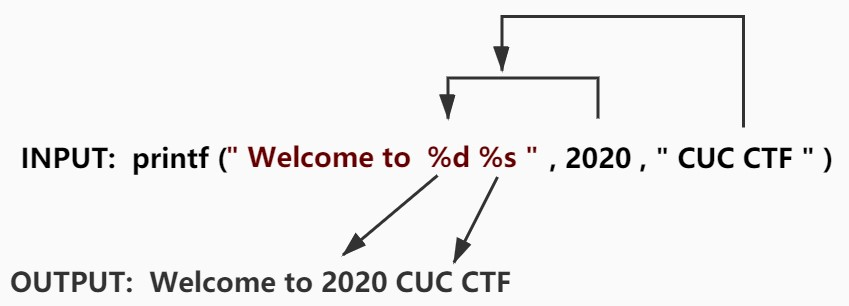</center>

<!-- 

此处的格式化字符串调用例子中
格式化字符串函数为 printf
格式化字符串为 " Welcode to  %d %s "
其余参数为可选参数

 -->

---

# 1.1.1 格式化字符串函数

**输入函数**
  - scanf

**输出函数**

|函数|基本介绍|
|---|---|
|printf|输出到 stdout|
|fprintf|输出到指定 FILE 流|
|syslog|输出日志|

---

# 1.1.2 格式化字符串 

```c
%[parameter][flags][field width][.precision][length]type
```

**type**
<!-- 需要重点关注的 -->

- d/i，有符号整数
- u，无符号整数
- x/X，16 进制 unsigned int 。x 使用小写字母；X 使用大写字母。
- n，不输出字符，但是把已经**成功输出**的字符个数写入对应的整型指针参数所指的变量。

---

# 1.1.3 参数

就是相应的要输出的变量

<!-- ---

我们再继续以上面的为例子进行介绍,对于上面的例子，在进入 printf 函数的之前 (即还没有调用 printf)，栈上的布局由高地址到低地址依次如下

```c

some value
CUC CTF 
2020
addr of format string: Welcode to  %d %s

``` -->

---

# 1.2 漏洞成因
---

<center><span>printf 格式化字符串函数执行流图</span></center>

<center>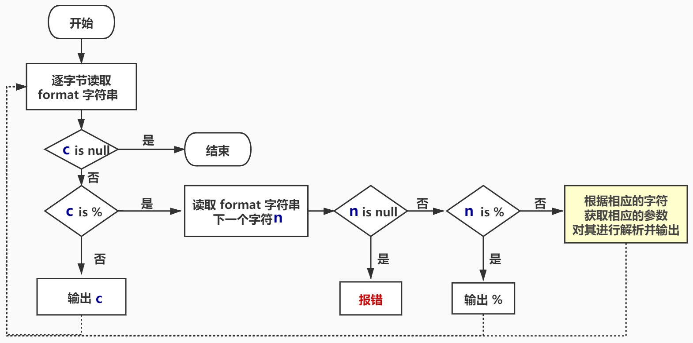</center>

---

那么假设，此时我们在编写程序时候，写成了如下形式：

```python
printf("Welcode to  %d %s");
```
</br>
<!-- 此时我们可以发现我们并没有提供参数，那么程序会如何运行呢？程序照样会运行，会将栈上存储格式化字符串地址上面的 2 个变量分别解析为
解析其内容对应的整形值
解析其地址对应的字符串
-->

<!-- 对于 1 来说倒还无妨，但是对于对于 2 来说，如果提供了一个不可访问地址，比如 0，那么程序就会因此而崩溃。 -->

执行输出结果:

<center>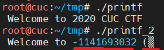</center>

</br>

漏洞原因：格式字符串**要求的参数**和**实际提供的参数**不匹配

---

**为什么可以通过编译？**
- 因为 printf() 函数的参数被定义为**可变**的。
  
- 为了发现不匹配的情况，编译器需要理解 printf() 是怎么工作的和格式字符串是什么。然而，编译器并不知道这些。
  
- 有时格式字符串并不是固定的，它可能在程序执行中**动态生成**。

---

**printf() 函数自己可以发现不匹配吗？**

printf() 函数从栈中取出参数，如果它需要 3 个，那它就取出 3 个。除非栈的边界被标记了，否则 printf() 是不会知道它取出的参数比提供给它的参数多了。然而并没有这样的标记。

---

# 1.3 格式化字符串漏洞利用


---

实验环境

```bash
ubuntu 16.04
gdb  7.8
gcc 5.4.0
```

---

例如，我们给定如下程序

```c
#include <stdio.h>
int main() {
  char s[100];
  int a = 1, b = 0x22222222, c = -1;
  scanf("%s", s);
  printf("%08x.%08x.%08x.%s\n", a, b, c, s);
  printf(s);
  return 0;
}
```
编译

```bash
$ gcc -m32 -fno-stack-protector -no-pie -o leakmemory leakmemory.c
```

---

### 1.3.1 使程序崩溃

崩溃原因是因为栈上不可能每个值都对应了合法的地址，所以总是会有某个地址可以使得程序崩溃（地址越界访问）。

<center>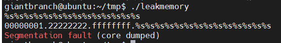</center>

---

### 1.3.2 查看栈内容

首先测试一下执行效果：

```bash
$ ./leakmemory

%08x.%08x.%08x
```

执行结果
```bash
./leakmemory
%08x.%08x.%08x
00000001.22222222.ffffffff.%08x.%08x.%08x
ffbbe980.000000c2.f7e4c79b
```
<!-- <center>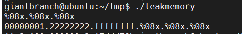</center> -->

---

为了更加细致的观察,使用 GDB 调试。

```bash
#使用 gdb 进行调试
$gdb leakmemory
# 下断点
gdb-peda$ b printf
    Breakpoint 1 at 0x8048330
#开始执行程序
gdb-peda$ r
    Starting program: /home/giantbranch/tmp/leakmemory
    ffb4e190.000000c2.f7d8f79bgiantbranch@ubuntu:~/tmp$


```
<!-- 此时，程序等待我们的输入，这时我们输入 %08x.%08x.%08x，然后敲击回车，是程序继续运行，可以看出程序首先断在了第一次调用 printf 函数的位置 -->

程序**断在 printf 函数首次调用位置**，查看栈空间。

---

<center>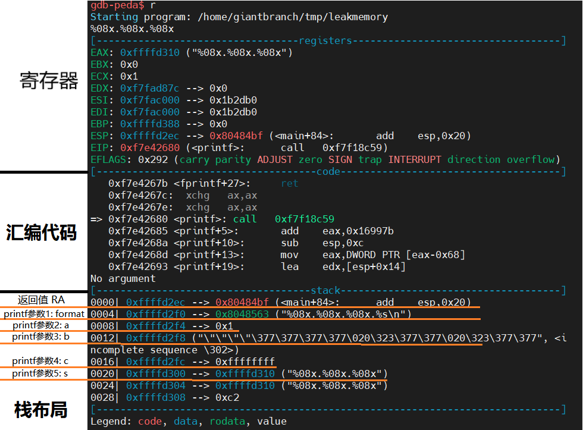</center>

<!-- 可以看出，此时已经进入了 printf 函数中，栈中第一个变量为返回地址，第二个变量为格式化字符串的地址，第三个变量为 a 的值，第四个变量为 b 的值，第五个变量为 c 的值，第六个变量为我们输入的格式化字符串对应的地址。继续运行程序 -->

---

继续执行，程序输出每个变量对应的值。并且断在了下一个 printf 处。

<!-- 此时，由于格式化字符串为 %x%x%x，所以，程序 会将栈上的 0xffffcd04 及其之后的数值分别作为第一，第二，第三个参数按照 int 型进行解析，分别输出。继续运行，我们可以得到如下结果去，确实和想象中的一样。 -->

<center>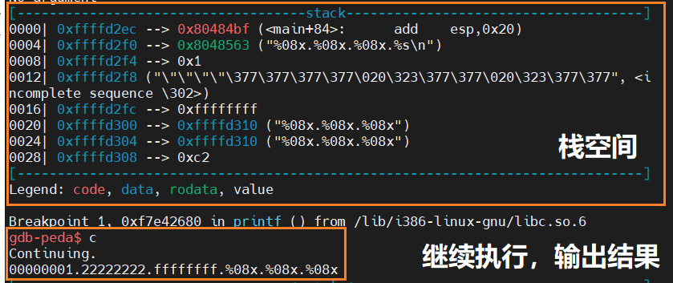</center>


---

继续执行，由于格式化字符串为 %x%x%x，所以，程序会将栈上的`0xffffd304`及之后的数值分别作为 1、2、3 个参数按照 int 型进行解析，分别输出。

<center>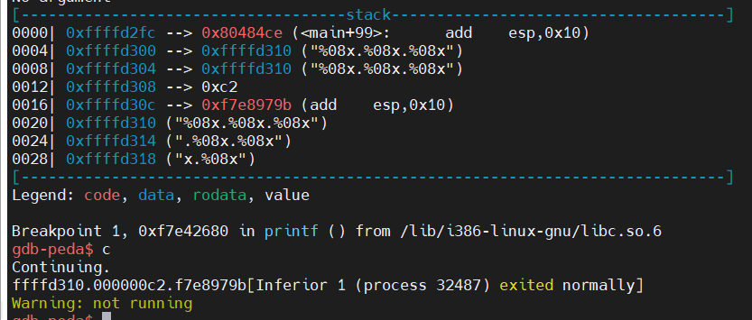</center>

---

### 1.3.2 直接获取栈中被视为第 n+1 个参数的值

 `%n$x`

</br>
为什么是第 n+1 个参数?

<!-- 格式化参数里面的 n 指的是该格式化字符串对应的**第 n 个输出参数**，
那相对于调用函数来说，**第 1 个参数是格式化字符串，不输出** , 就是第 n+1 个参数了。 -->

<center>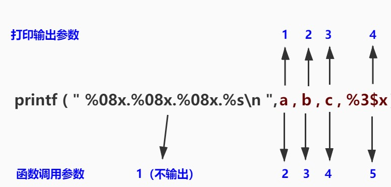</center>

---

重新调试运行，可以看出，我们确实获得了 **printf 的第 4 个参数**所对应的值 f7e8979b。

<center>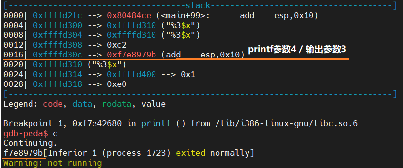</center>

---

### 1.3.3 查看任意内存的地址

原理：**显示指定解析地址的内存**

例如：printf 参数存储字符串起始地址，输出 %s 时，读取参数内容并将其作为字符串起始地址,直到遇到一个空字符,读取结束。

<center>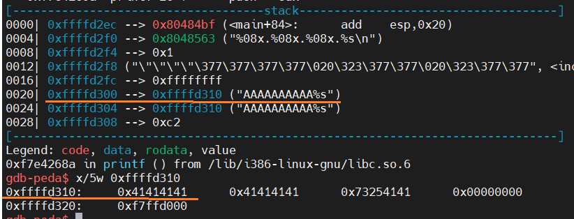</center>

<!-- 使用 %s 显示参数，指针所指定的地址的内存，将它作为一个 ASCII 字符串处理，直到遇到一个空字符。如果攻击者能够操纵这个参数指针指向一个特定的地址，那么 %s 就会输出该位置的内存内容。 -->

---

### (1). 获取输入参数在栈上的偏移

由 0x41414141 处所在的位置可以看出我们的格式化字符串的起始地址正好是输出函数的第 5 个参数，但是是格式化字符串的第 4 个参数。我们可以来测试一下

<center>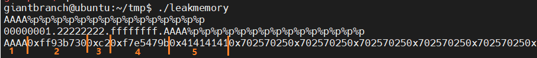</center>

### (2). 根据偏移查看输出内容

0x41414141 是输出的第 4 个字符，所以我们使用 %4$p 即可读出 0x41414141 处的内容，
```bash
$ ./leakmemory
AAAA%4$p
00000001.22222222.ffffffff.AAAA%4$p
AAAA0x41414141
```

---

当然，这可能是一个不合法的地址。我们把 AAAA 换成我们需要的合法的地址即可查看对应地址的内容。


```bash
python2 -c 'print("AAA" + "\00\x10\xd3\xff\xff"+".%5$s")' > text
```

<center>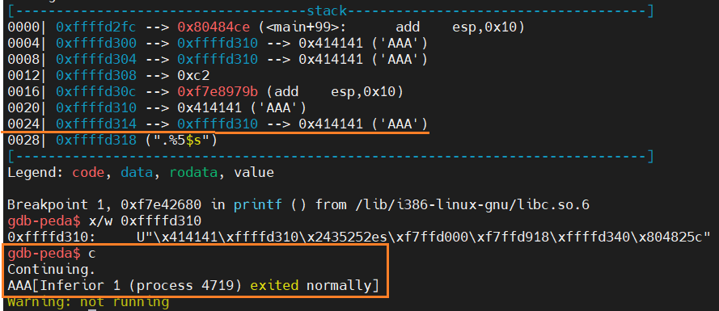</center>

---


## 2 格式化字符串漏洞练习题

- [XCTF-攻防世界 CGfsb 格式化字符串漏洞](https://adworld.xctf.org.cn/task/answer?type=pwn&number=2&grade=0&id=5050&page=1)
- [实时数据监测](https://adworld.xctf.org.cn/task/answer?type=pwn&number=2&grade=1&id=4913&page=1)

---

## 参考资料

- [ctf wiki](https://ctf-wiki.github.io/ctf-wiki/pwn/linux/fmtstr/fmtstr_exploit-zh/#_4)
- [ctf alll in one](https://firmianay.gitbooks.io/ctf-all-in-one/content/doc/2.3.1_gdb.html)